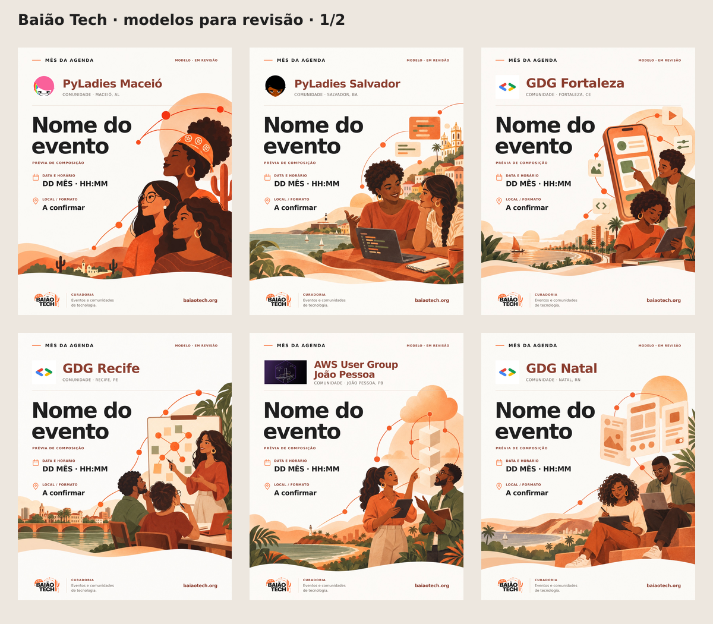
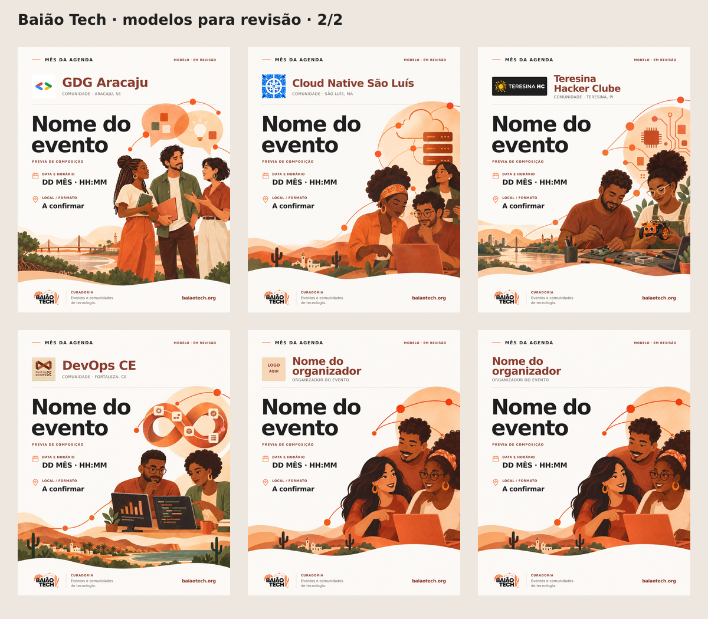

# Galeria de revisão — cards completos

20 comunidades com ilustrações próprias e 2 genéricos. **Todos os cards finais têm a assinatura do Baião Tech no rodapé.**

Campos demonstrativos. Novos modelos em revisão; não publicar.

## Referência já aprovada

Preservada sem alterações para comparação com o modelo editável de PyLadies Maceió.

## 01. PyLadies Maceió

Mulheres, pertencimento e conexões; deriva da referência aprovada de PyLadies Maceió.

[Abrir SVG editável](comunidades/pyladies-maceio/modelo.svg) · [Ver regras e origem](comunidades/pyladies-maceio/estilo.json)

## 02. PyLadies Salvador

Duas mulheres em mentoria e programação em dupla, com paisagem inspirada na baía de Salvador.

[Abrir SVG editável](comunidades/pyladies-salvador/modelo.svg) · [Ver regras e origem](comunidades/pyladies-salvador/estilo.json)

## 03. GDG Fortaleza

Codelab de aplicativos, smartphone e interfaces, com inspiração na orla de Fortaleza.

[Abrir SVG editável](comunidades/gdg-fortaleza/modelo.svg) · [Ver regras e origem](comunidades/gdg-fortaleza/estilo.json)

## 04. GDG Recife

Troca de conhecimento em grupo, quadro de conexões e paisagem inspirada nos rios e pontes do Recife.

[Abrir SVG editável](comunidades/gdg-recife/modelo.svg) · [Ver regras e origem](comunidades/gdg-recife/estilo.json)

## 05. AWS User Group João Pessoa

Discussão de arquitetura em nuvem, módulos conectados e paisagem costeira inspirada em João Pessoa.

[Abrir SVG editável](comunidades/aws-user-group-joao-pessoa/modelo.svg) · [Ver regras e origem](comunidades/aws-user-group-joao-pessoa/estilo.json)

## 06. GDG Natal

Experimentação de interfaces em tablets e notebooks, com degraus e dunas inspiradas em Natal.

[Abrir SVG editável](comunidades/gdg-natal/modelo.svg) · [Ver regras e origem](comunidades/gdg-natal/estilo.json)

## 07. GDG Aracaju

Encontro e conversa entre desenvolvedores, balões de ideias e paisagem fluvial inspirada em Aracaju.

[Abrir SVG editável](comunidades/gdg-aracaju/modelo.svg) · [Ver regras e origem](comunidades/gdg-aracaju/estilo.json)

## 08. Cloud Native São Luís

Profissionais colaborando com infraestrutura, nuvem e servidores conectados.

[Abrir SVG editável](comunidades/cloud-native-sao-luis/modelo.svg) · [Ver regras e origem](comunidades/cloud-native-sao-luis/estilo.json)

## 09. Teresina Hacker Clube

Makers construindo um robô educacional e explorando eletrônica, com paisagem inspirada nos rios de Teresina.

[Abrir SVG editável](comunidades/teresina-hacker-clube/modelo.svg) · [Ver regras e origem](comunidades/teresina-hacker-clube/estilo.json)

## 10. DevOps CE

Colaboração em confiabilidade, telas de operação e ciclo contínuo de automação.

[Abrir SVG editável](comunidades/devops-ce/modelo.svg) · [Ver regras e origem](comunidades/devops-ce/estilo.json)

## 11. Genérico com logo

Comunidade aberta de tecnologia e conexão entre pessoas, sem atribuição a uma organização cadastrada.

[Abrir SVG editável](genericos/com-logo/modelo.svg) · [Ver regras e origem](genericos/com-logo/estilo.json)

## 12. Genérico sem logo

Comunidade aberta de tecnologia e conexão entre pessoas, sem atribuição a uma organização cadastrada.

[Abrir SVG editável](genericos/sem-logo/modelo.svg) · [Ver regras e origem](genericos/sem-logo/estilo.json)

## Lotes adicionais

- [lote-03 — 10 comunidades](lotes/lote-03.md)
