# Galeria de modelos finais — Baião Tech

93 comunidades e dois genéricos aprovados. Os campos editáveis devem receber dados verificados de cada evento.

[Guia de uso diário](README.md) · [Catálogo](catalogo.json) · [Registro de aprovação](APROVACAO.json)

## PyLadies Maceió

Mulheres, pertencimento e conexões; deriva da referência aprovada de PyLadies Maceió.

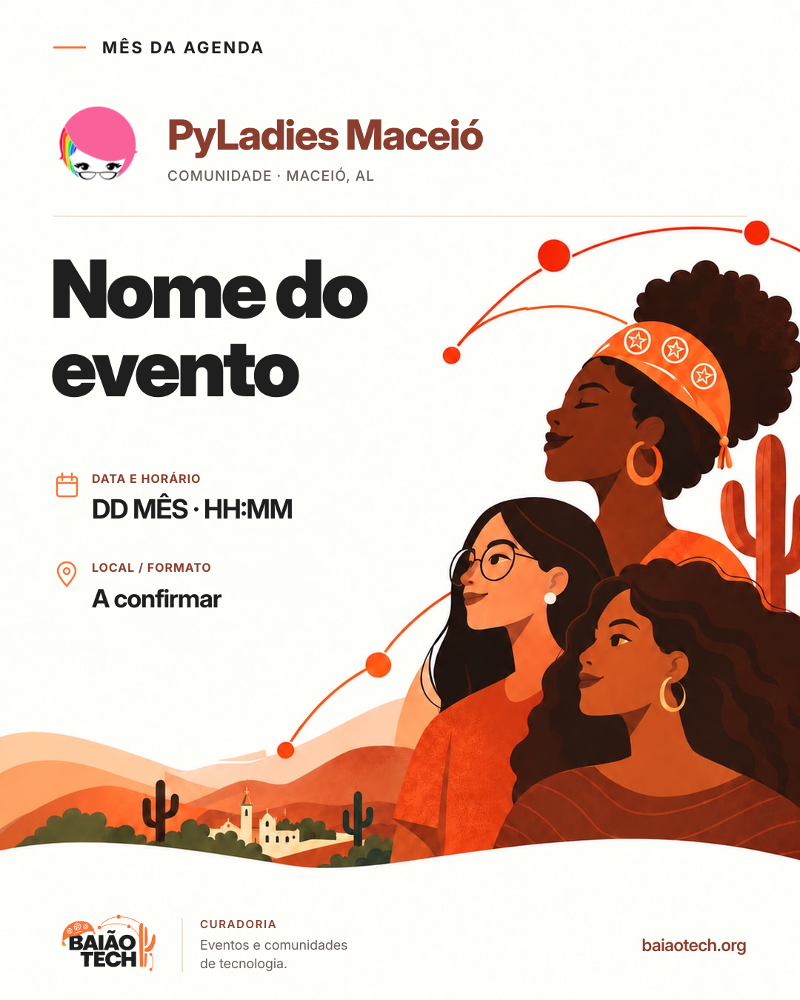

[SVG editável](comunidades/pyladies-maceio/modelo.svg) · [PNG](comunidades/pyladies-maceio/modelo.png) · [Estilo](comunidades/pyladies-maceio/estilo.json)

## PyLadies Salvador

Duas mulheres em mentoria e programação em dupla, com paisagem inspirada na baía de Salvador.

[SVG editável](comunidades/pyladies-salvador/modelo.svg) · [PNG](comunidades/pyladies-salvador/modelo.png) · [Estilo](comunidades/pyladies-salvador/estilo.json)

## GDG Fortaleza

Codelab de aplicativos, smartphone e interfaces, com inspiração na orla de Fortaleza.

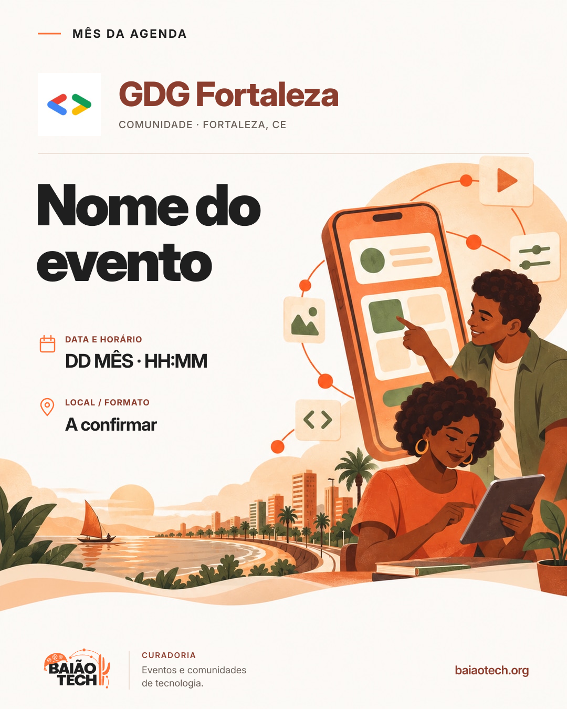

[SVG editável](comunidades/gdg-fortaleza/modelo.svg) · [PNG](comunidades/gdg-fortaleza/modelo.png) · [Estilo](comunidades/gdg-fortaleza/estilo.json)

## GDG Recife

Troca de conhecimento em grupo, quadro de conexões e paisagem inspirada nos rios e pontes do Recife.

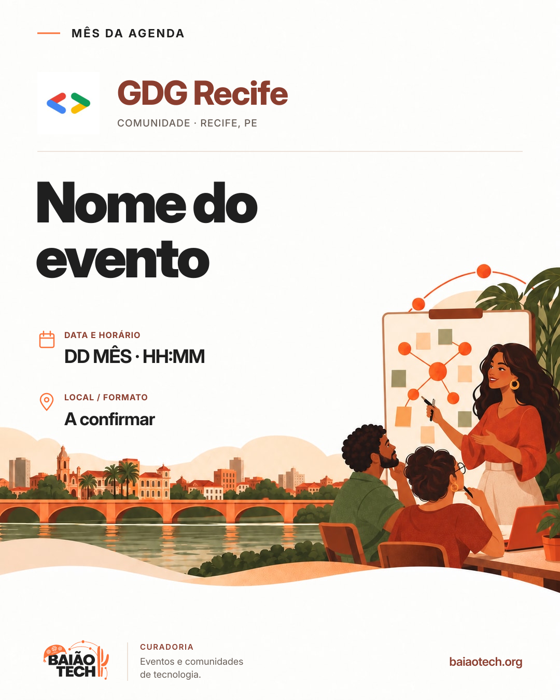

[SVG editável](comunidades/gdg-recife/modelo.svg) · [PNG](comunidades/gdg-recife/modelo.png) · [Estilo](comunidades/gdg-recife/estilo.json)

## AWS User Group João Pessoa

Discussão de arquitetura em nuvem, módulos conectados e paisagem costeira inspirada em João Pessoa.

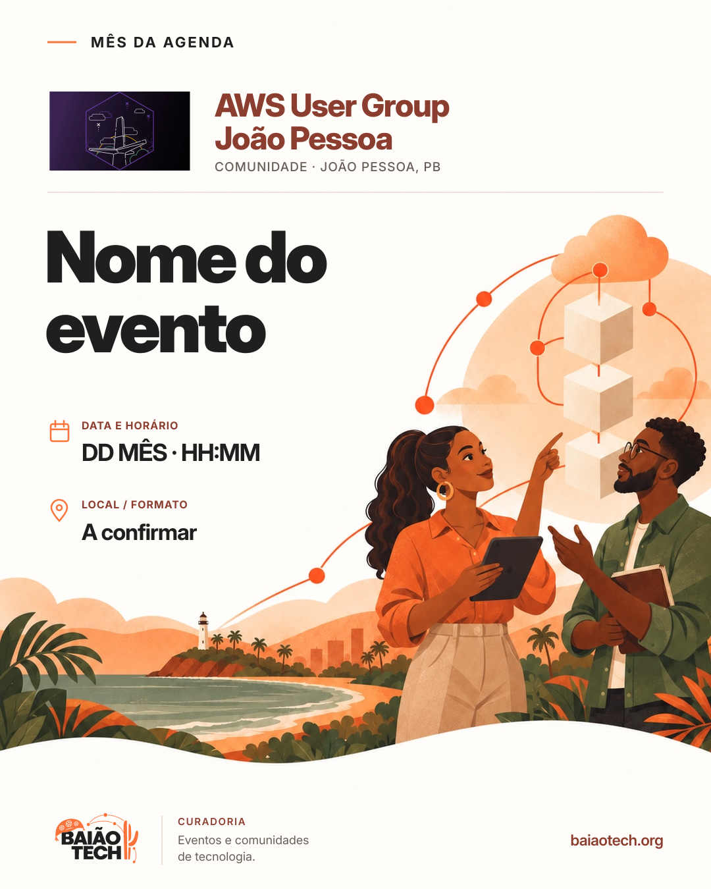

[SVG editável](comunidades/aws-user-group-joao-pessoa/modelo.svg) · [PNG](comunidades/aws-user-group-joao-pessoa/modelo.png) · [Estilo](comunidades/aws-user-group-joao-pessoa/estilo.json)

## GDG Natal

Experimentação de interfaces em tablets e notebooks, com degraus e dunas inspiradas em Natal.

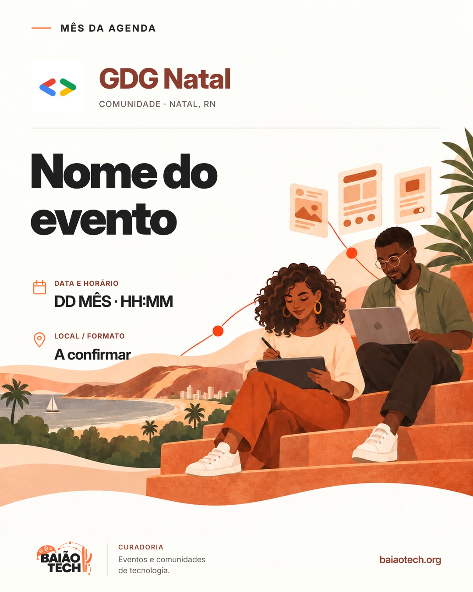

[SVG editável](comunidades/gdg-natal/modelo.svg) · [PNG](comunidades/gdg-natal/modelo.png) · [Estilo](comunidades/gdg-natal/estilo.json)

## GDG Aracaju

Encontro e conversa entre desenvolvedores, balões de ideias e paisagem fluvial inspirada em Aracaju.

[SVG editável](comunidades/gdg-aracaju/modelo.svg) · [PNG](comunidades/gdg-aracaju/modelo.png) · [Estilo](comunidades/gdg-aracaju/estilo.json)

## Cloud Native São Luís

Profissionais colaborando com infraestrutura, nuvem e servidores conectados.

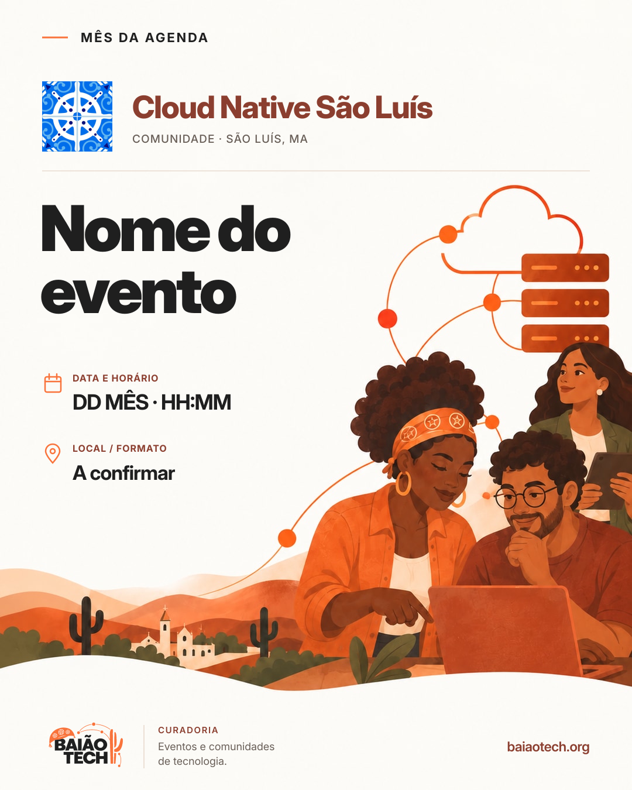

[SVG editável](comunidades/cloud-native-sao-luis/modelo.svg) · [PNG](comunidades/cloud-native-sao-luis/modelo.png) · [Estilo](comunidades/cloud-native-sao-luis/estilo.json)

## Teresina Hacker Clube

Makers construindo um robô educacional e explorando eletrônica, com paisagem inspirada nos rios de Teresina.

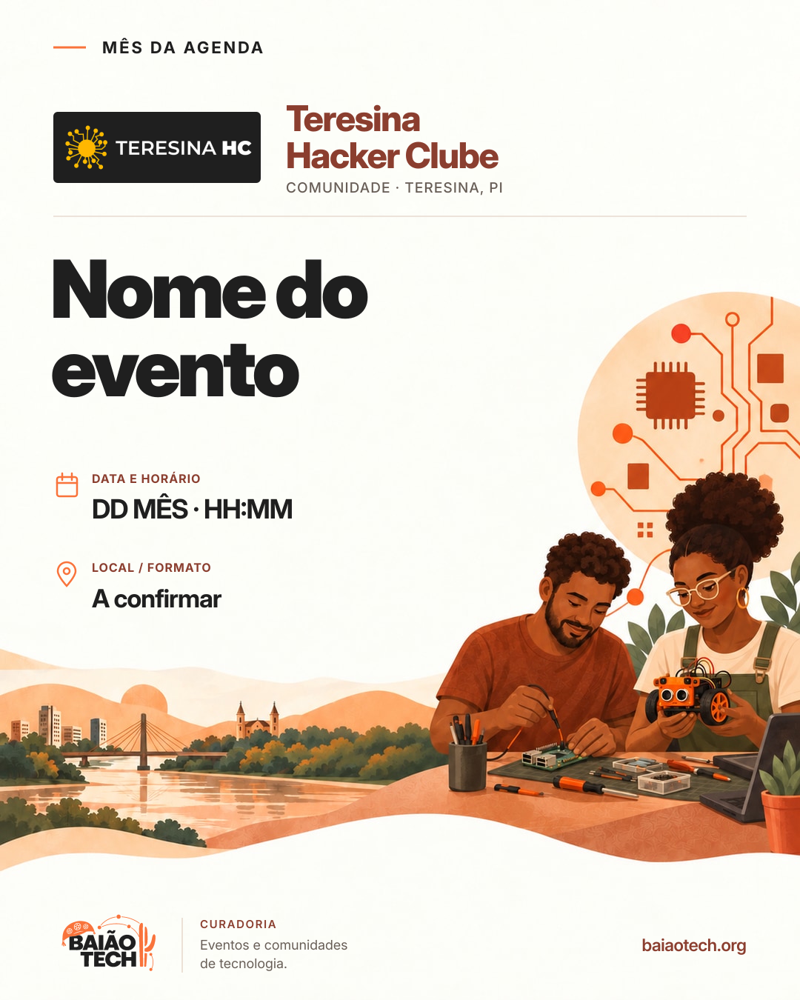

[SVG editável](comunidades/teresina-hacker-clube/modelo.svg) · [PNG](comunidades/teresina-hacker-clube/modelo.png) · [Estilo](comunidades/teresina-hacker-clube/estilo.json)

## DevOps CE

Colaboração em confiabilidade, telas de operação e ciclo contínuo de automação.

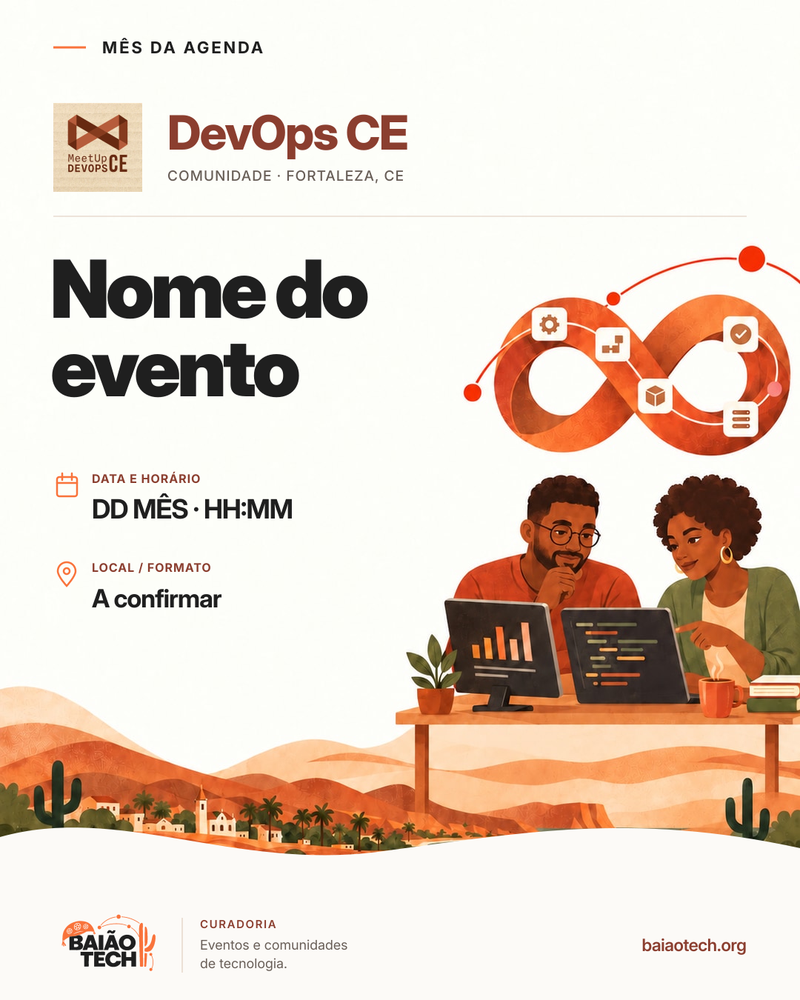

[SVG editável](comunidades/devops-ce/modelo.svg) · [PNG](comunidades/devops-ce/modelo.png) · [Estilo](comunidades/devops-ce/estilo.json)

## Ceará Java User Group

Troca intergeracional de conhecimento e módulos do ecossistema JVM no Ceará.

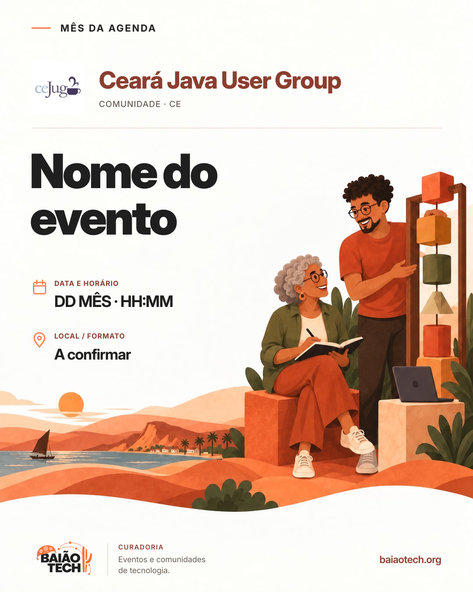

[SVG editável](comunidades/ceara-java-user-group/modelo.svg) · [PNG](comunidades/ceara-java-user-group/modelo.png) · [Estilo](comunidades/ceara-java-user-group/estilo.json)

## Cloud Native RN

Oficina colaborativa de nuvem e microsserviços junto às dunas de Natal.

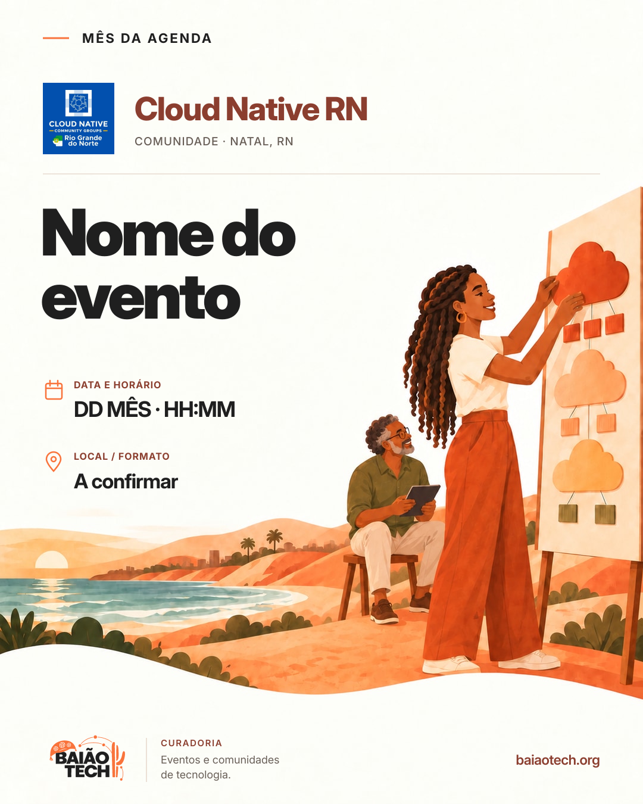

[SVG editável](comunidades/cloud-native-rn/modelo.svg) · [PNG](comunidades/cloud-native-rn/modelo.png) · [Estilo](comunidades/cloud-native-rn/estilo.json)

## CODAR Salvador

Desenvolvimento open-source colaborativo e conexões entre módulos na baía de Salvador.

[SVG editável](comunidades/codar-salvador/modelo.svg) · [PNG](comunidades/codar-salvador/modelo.png) · [Estilo](comunidades/codar-salvador/estilo.json)

## Conecta Nordeste

Conexões entre empreendedores e ecossistemas de inovação do Nordeste.

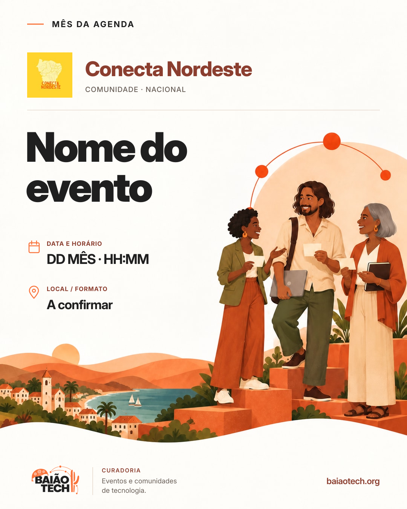

[SVG editável](comunidades/conecta-nordeste/modelo.svg) · [PNG](comunidades/conecta-nordeste/modelo.png) · [Estilo](comunidades/conecta-nordeste/estilo.json)

## DevOps JP

Responsabilidade compartilhada pela entrega e confiabilidade de software em João Pessoa.

[SVG editável](comunidades/devops-jp/modelo.svg) · [PNG](comunidades/devops-jp/modelo.png) · [Estilo](comunidades/devops-jp/estilo.json)

## Django Girls Salvador

Primeiros passos na programação web com mentoria inclusiva entre mulheres em Salvador.

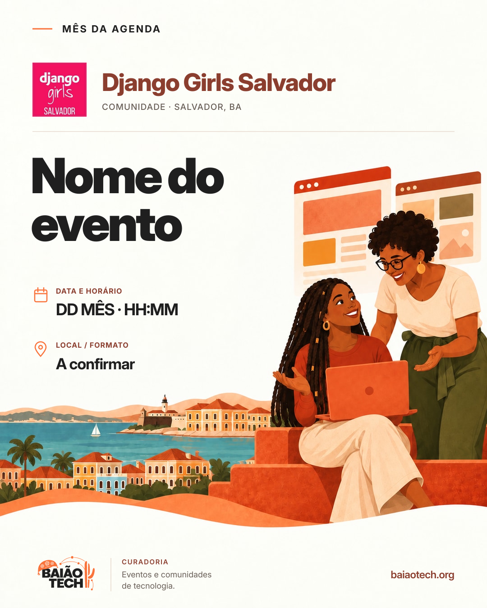

[SVG editável](comunidades/django-girls-salvador/modelo.svg) · [PNG](comunidades/django-girls-salvador/modelo.png) · [Estilo](comunidades/django-girls-salvador/estilo.json)

## DotNet Recife

Conhecimento compartilhado sobre camadas de aplicações e serviços .NET no Recife.

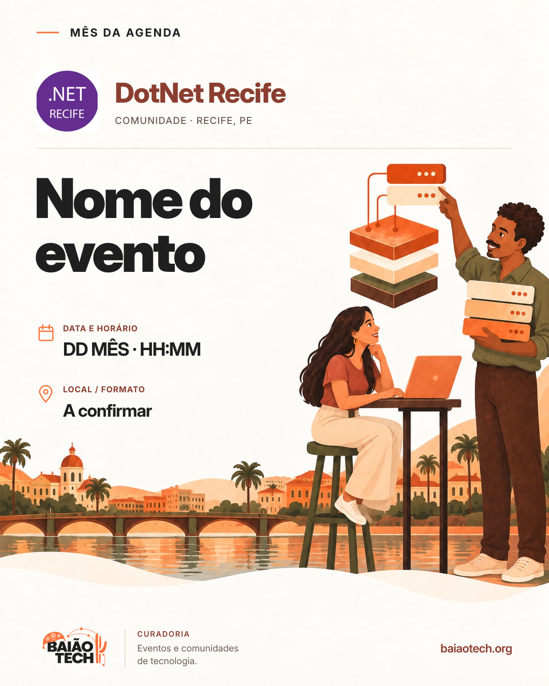

[SVG editável](comunidades/dotnet-recife/modelo.svg) · [PNG](comunidades/dotnet-recife/modelo.png) · [Estilo](comunidades/dotnet-recife/estilo.json)

## Elug CE

Programação funcional, processos e troca de mensagens como construção colaborativa no Ceará.

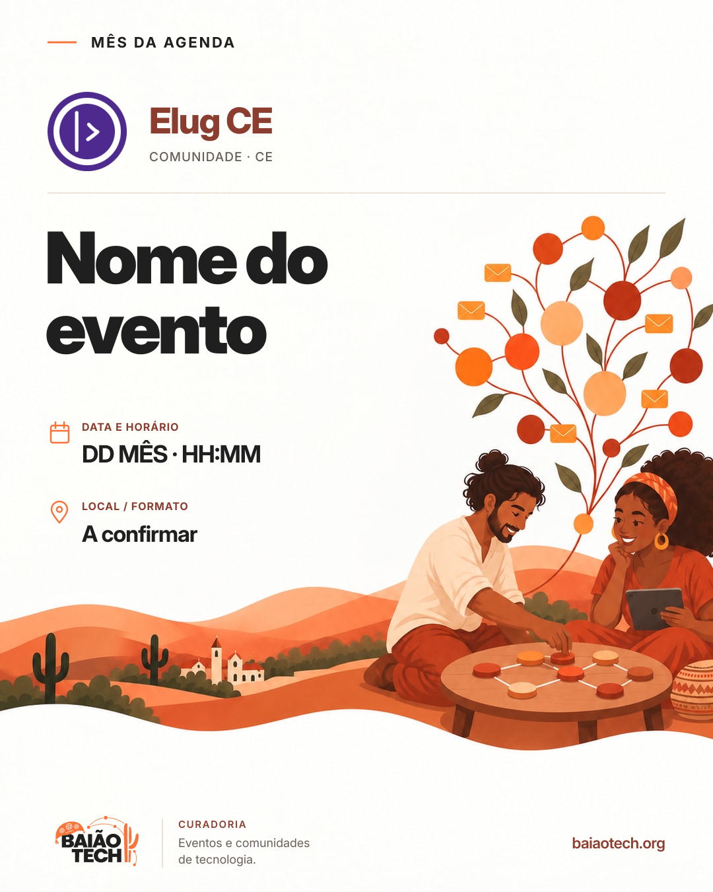

[SVG editável](comunidades/elug-ce/modelo.svg) · [PNG](comunidades/elug-ce/modelo.png) · [Estilo](comunidades/elug-ce/estilo.json)

## FEMUG-PE

Criação colaborativa de interfaces responsivas e experimentação front-end no Recife.

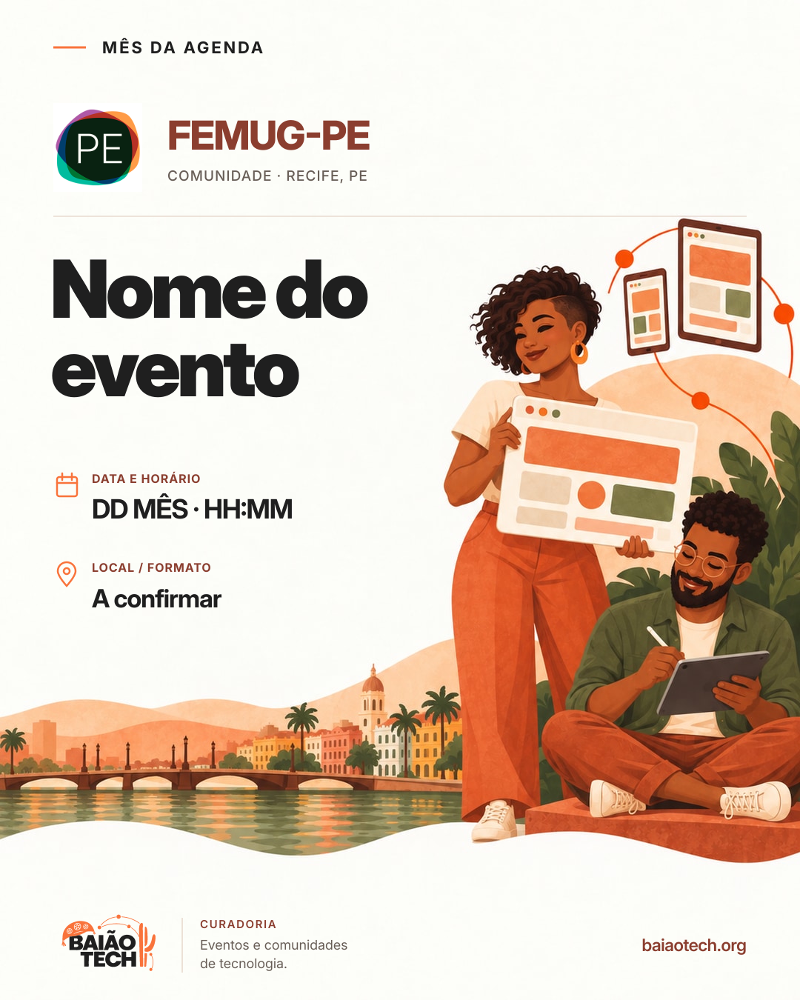

[SVG editável](comunidades/femug-pe/modelo.svg) · [PNG](comunidades/femug-pe/modelo.png) · [Estilo](comunidades/femug-pe/estilo.json)

## ForHacker Space

Laboratório comunitário de hardware livre e eletrônica, com aprendizado prático entre makers em Fortaleza.

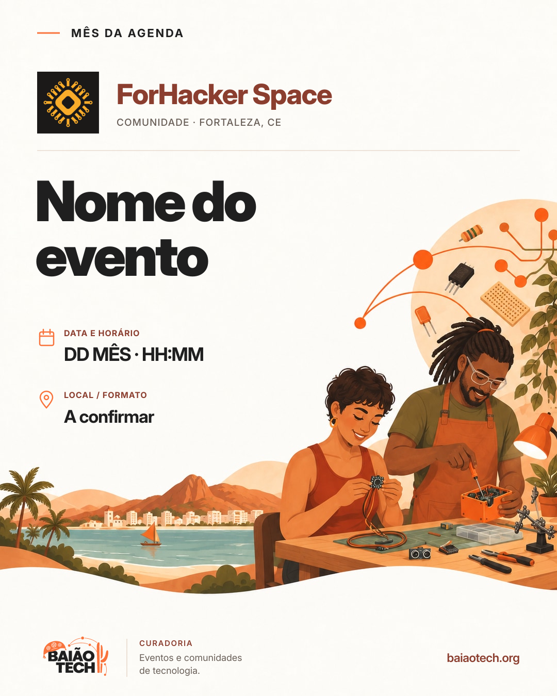

[SVG editável](comunidades/forhacker-space/modelo.svg) · [PNG](comunidades/forhacker-space/modelo.png) · [Estilo](comunidades/forhacker-space/estilo.json)

## Agenda TI Potiguar

Curadoria de eventos de tecnologia, conexão entre agendas e encontros no Rio Grande do Norte.

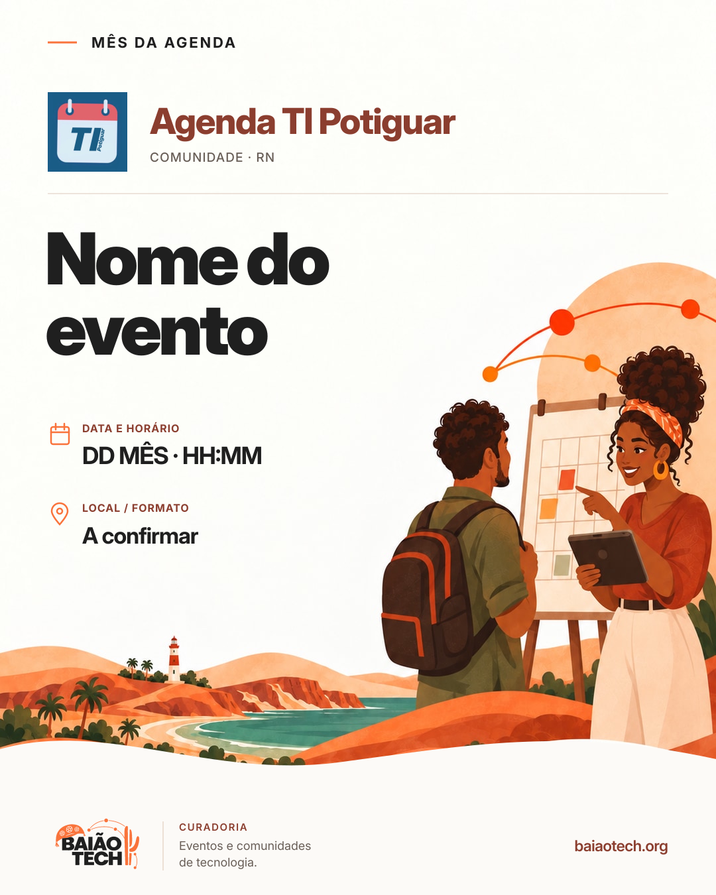

[SVG editável](comunidades/agenda-ti-potiguar/modelo.svg) · [PNG](comunidades/agenda-ti-potiguar/modelo.png) · [Estilo](comunidades/agenda-ti-potiguar/estilo.json)

## Agile Maranhão

Facilitação de práticas ágeis com quadro visual e colaboração no Maranhão.

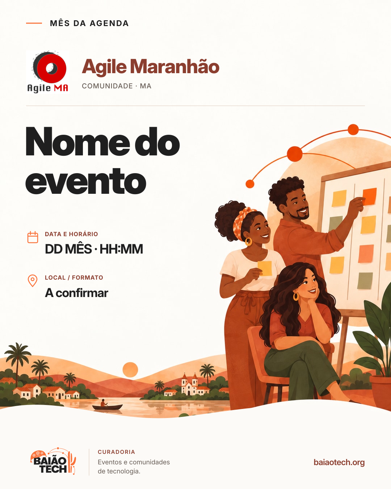

[SVG editável](comunidades/agile-maranhao/modelo.svg) · [PNG](comunidades/agile-maranhao/modelo.png) · [Estilo](comunidades/agile-maranhao/estilo.json)

## All Saints Bay

Conexão entre empreendedores e investidores em Salvador, com apresentação de protótipo e rede de ideias junto à baía.

[SVG editável](comunidades/all-saints-bay/modelo.svg) · [PNG](comunidades/all-saints-bay/modelo.png) · [Estilo](comunidades/all-saints-bay/estilo.json)

## APGameD

Desenvolvimento de jogos e testes colaborativos de controles na Paraíba.

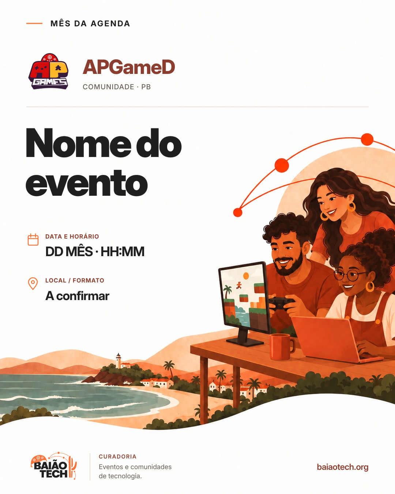

[SVG editável](comunidades/apgamed/modelo.svg) · [PNG](comunidades/apgamed/modelo.png) · [Estilo](comunidades/apgamed/estilo.json)

## Arretadas do PHP

Mulheres desenvolvedoras compartilhando conhecimento de programação PHP no Ceará.

[SVG editável](comunidades/arretadas-do-php/modelo.svg) · [PNG](comunidades/arretadas-do-php/modelo.png) · [Estilo](comunidades/arretadas-do-php/estilo.json)

## AWS User Group Ceará

Discussão de arquitetura em nuvem entre profissionais do Ceará.

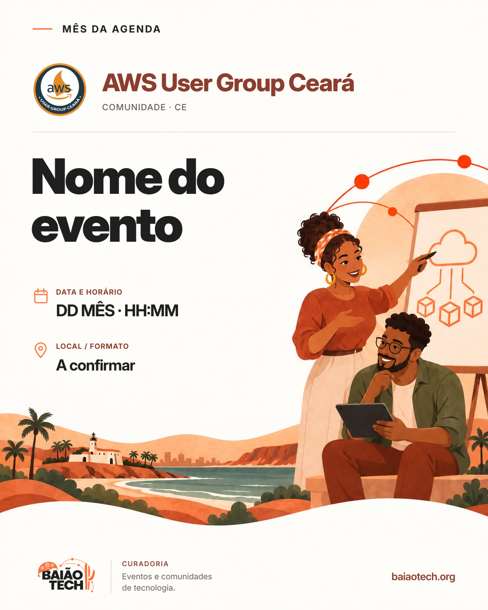

[SVG editável](comunidades/aws-user-group-ceara/modelo.svg) · [PNG](comunidades/aws-user-group-ceara/modelo.png) · [Estilo](comunidades/aws-user-group-ceara/estilo.json)

## Bahia Indie Game Developers

Criação independente de mundos de jogos na Bahia: arte digital e planejamento narrativo de cenários.

[SVG editável](comunidades/bahia-indie-game-developers/modelo.svg) · [PNG](comunidades/bahia-indie-game-developers/modelo.png) · [Estilo](comunidades/bahia-indie-game-developers/estilo.json)

## Caju Valley

Empreendedorismo e prototipagem colaborativa em Aracaju com referência ao caju.

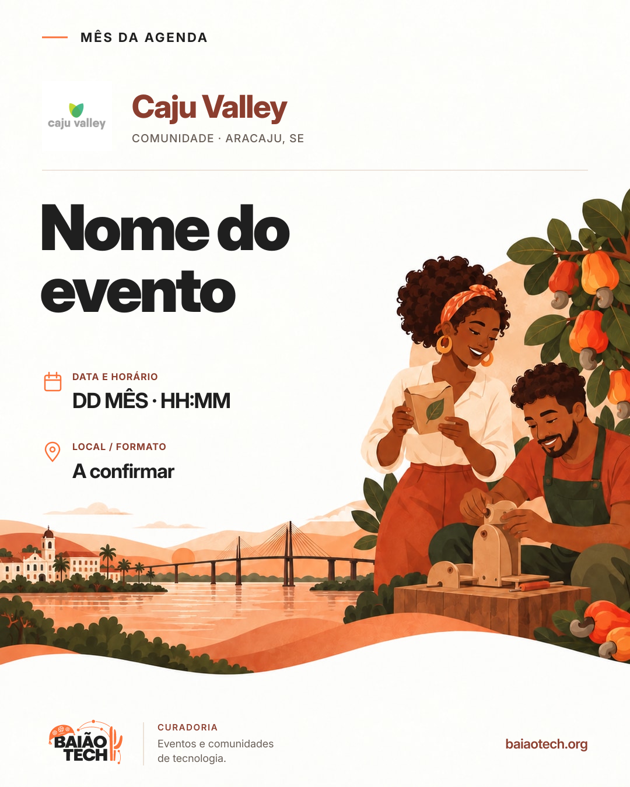

[SVG editável](comunidades/caju-valley/modelo.svg) · [PNG](comunidades/caju-valley/modelo.png) · [Estilo](comunidades/caju-valley/estilo.json)

## Cajuína Valley

Networking de inovação em Teresina, cajuína e conexões empreendedoras.

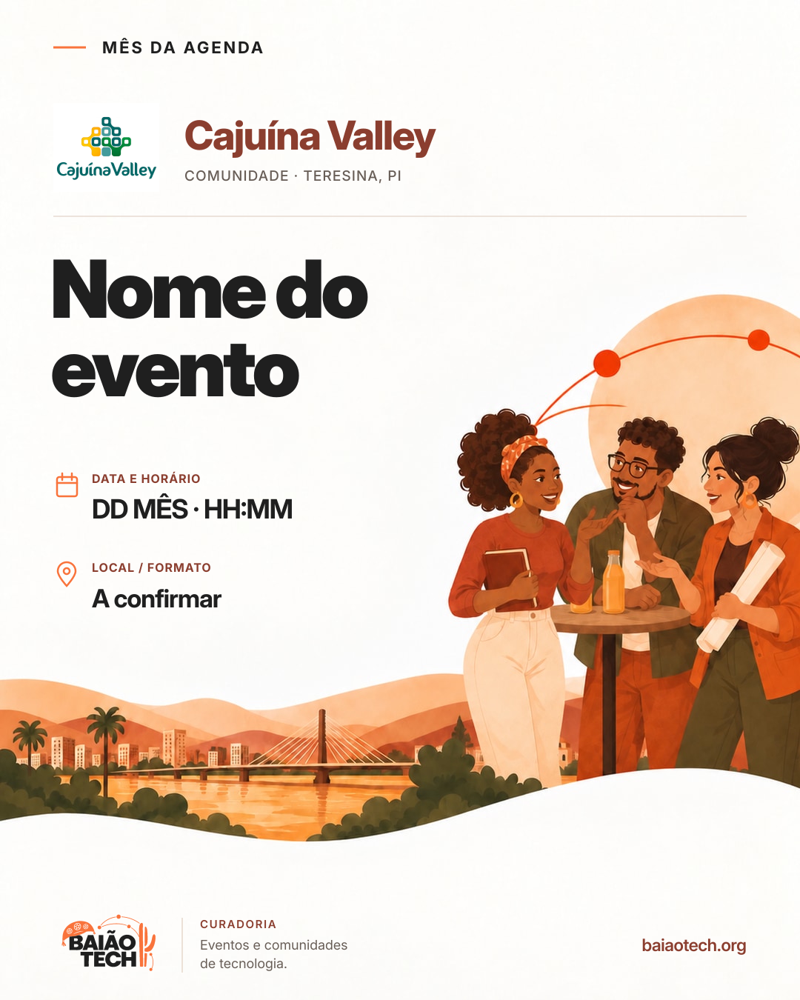

[SVG editável](comunidades/cajuina-valley/modelo.svg) · [PNG](comunidades/cajuina-valley/modelo.png) · [Estilo](comunidades/cajuina-valley/estilo.json)

## Carnaúba Valley

Conexão entre academia, público e empreendedorismo digital em Parnaíba, com carnaúba como rede regional de inovação.

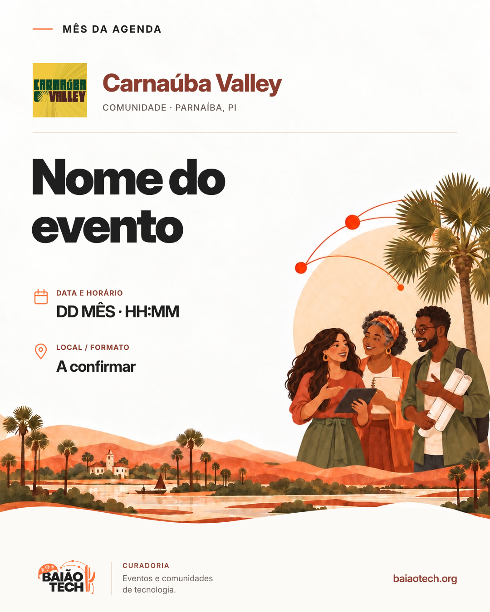

[SVG editável](comunidades/carnauba-valley/modelo.svg) · [PNG](comunidades/carnauba-valley/modelo.png) · [Estilo](comunidades/carnauba-valley/estilo.json)

## Front-End CE

Oficina de interfaces responsivas e construção visual no litoral cearense.

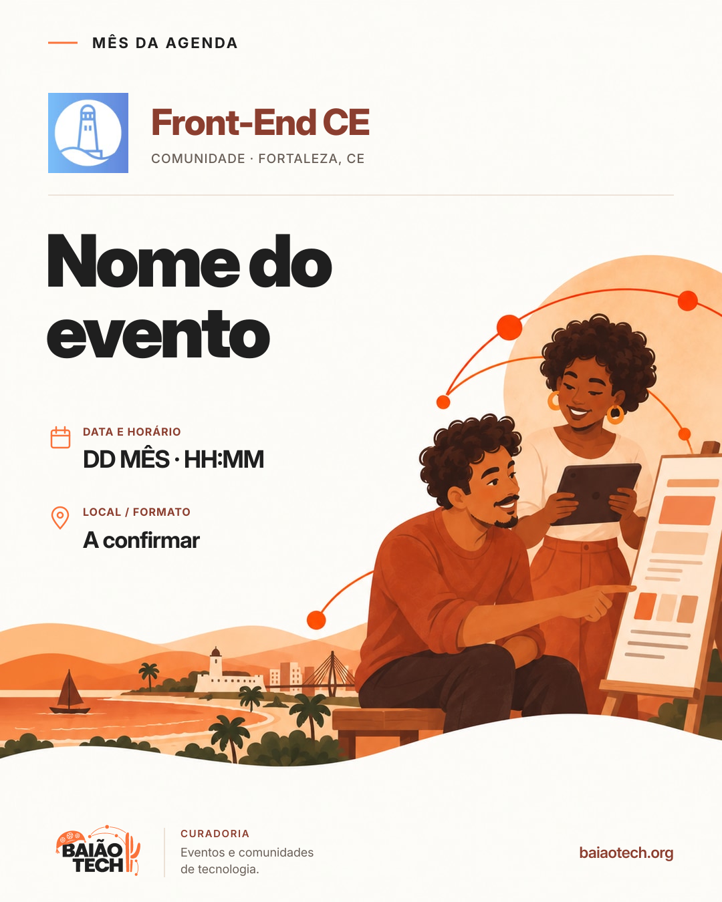

[SVG editável](comunidades/front-end-ce/modelo.svg) · [PNG](comunidades/front-end-ce/modelo.png) · [Estilo](comunidades/front-end-ce/estilo.json)

## GDG Feira de Santana

Oficina multitecnologia e troca de saberes no interior baiano.

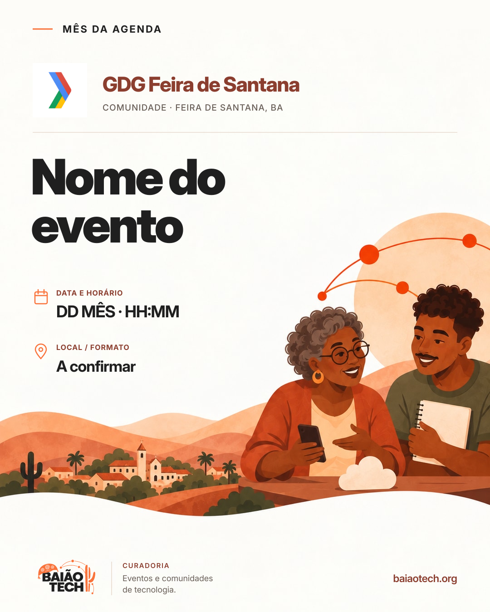

[SVG editável](comunidades/gdg-feira-de-santana/modelo.svg) · [PNG](comunidades/gdg-feira-de-santana/modelo.png) · [Estilo](comunidades/gdg-feira-de-santana/estilo.json)

## GDG João Pessoa

Rede de aprendizado entre desenvolvedores junto à paisagem costeira paraibana.

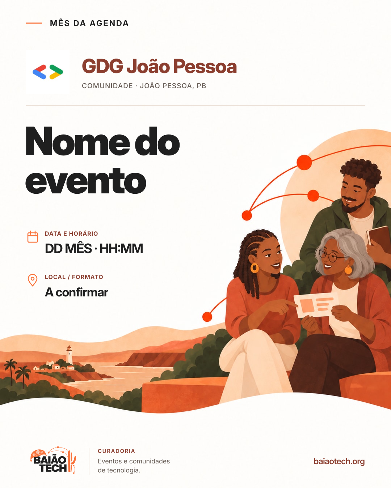

[SVG editável](comunidades/gdg-joao-pessoa/modelo.svg) · [PNG](comunidades/gdg-joao-pessoa/modelo.png) · [Estilo](comunidades/gdg-joao-pessoa/estilo.json)

## GDG Maceió

Demonstração de aplicativos e aprendizado coletivo em Alagoas.

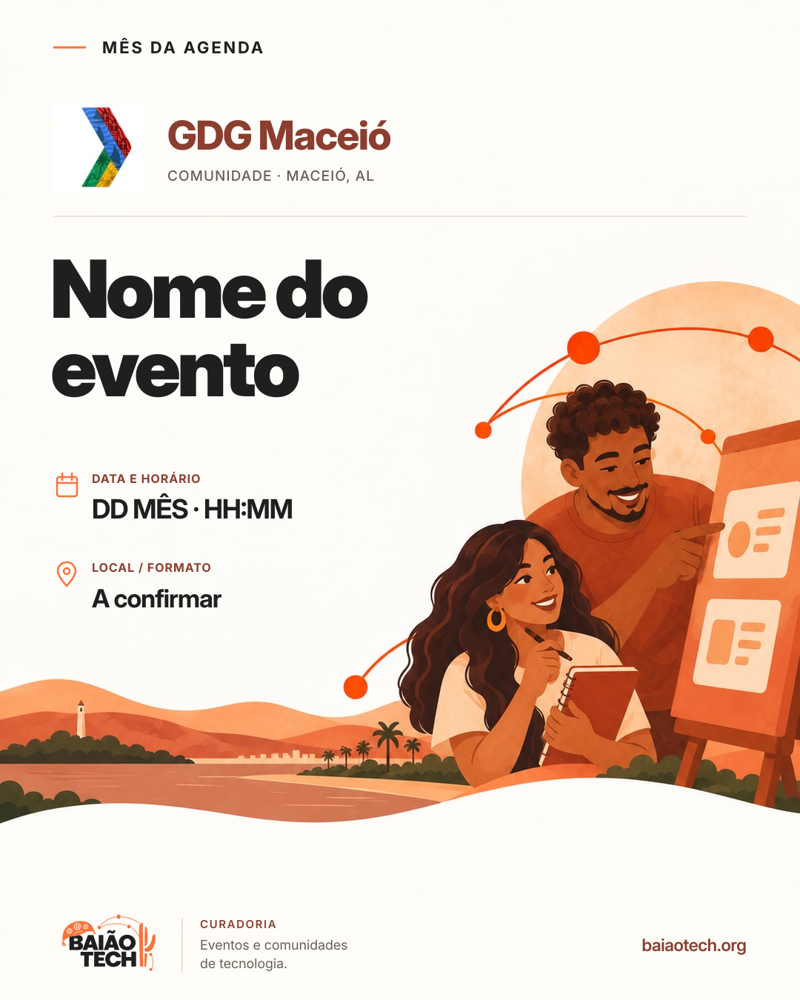

[SVG editável](comunidades/gdg-maceio/modelo.svg) · [PNG](comunidades/gdg-maceio/modelo.png) · [Estilo](comunidades/gdg-maceio/estilo.json)

## GDG Parnaíba

Conexões regionais de tecnologia inspiradas nos canais do delta.

[SVG editável](comunidades/gdg-parnaiba/modelo.svg) · [PNG](comunidades/gdg-parnaiba/modelo.png) · [Estilo](comunidades/gdg-parnaiba/estilo.json)

## GDG Salvador

Prototipação colaborativa e encontro de tecnologias em Salvador.

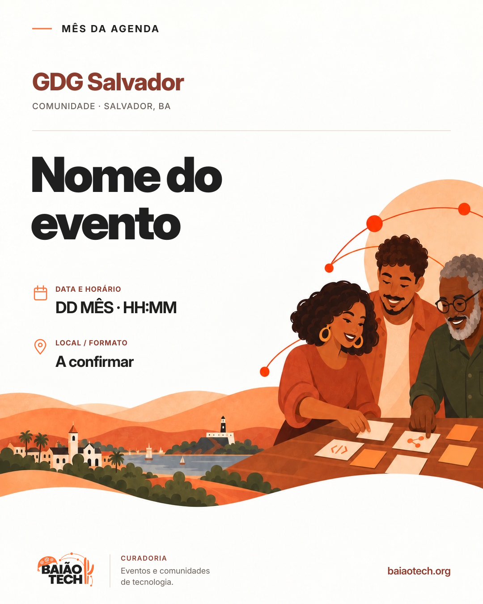

[SVG editável](comunidades/gdg-salvador/modelo.svg) · [PNG](comunidades/gdg-salvador/modelo.png) · [Estilo](comunidades/gdg-salvador/estilo.json)

## GDG São Luís

Intercâmbio de conhecimento em tecnologia e mosaico urbano ludovicense.

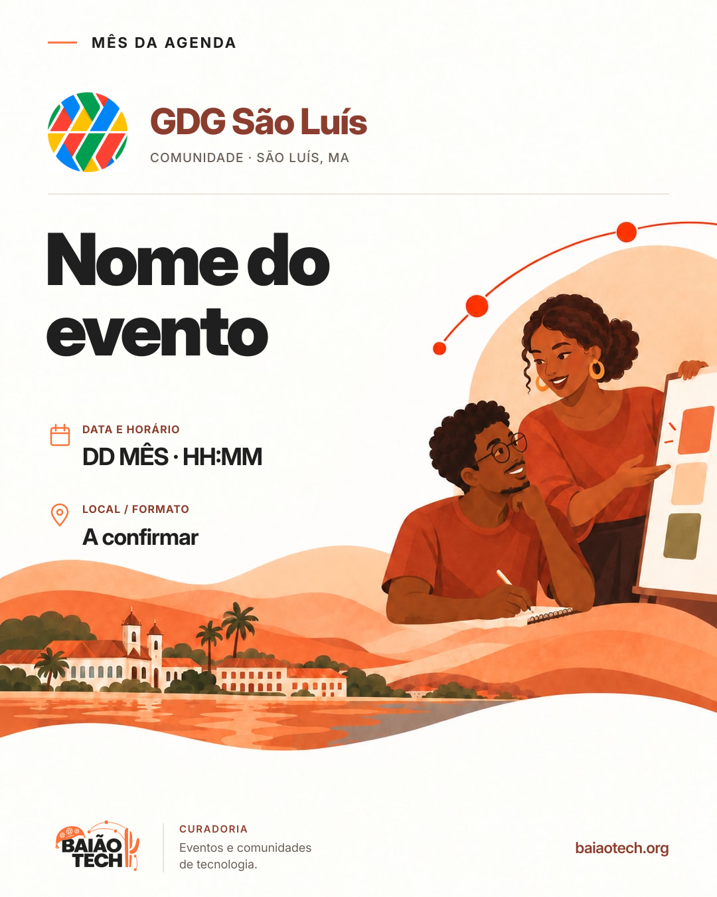

[SVG editável](comunidades/gdg-sao-luis/modelo.svg) · [PNG](comunidades/gdg-sao-luis/modelo.png) · [Estilo](comunidades/gdg-sao-luis/estilo.json)

## Geek Night Recife

Lightning talks, escuta e convivência na cena tecnológica recifense.

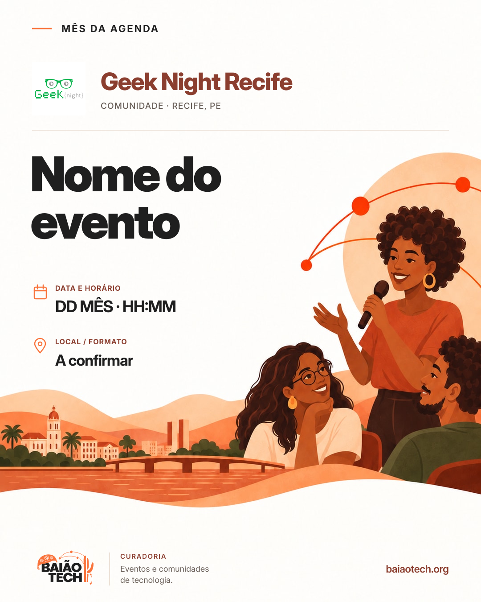

[SVG editável](comunidades/geek-night-recife/modelo.svg) · [PNG](comunidades/geek-night-recife/modelo.png) · [Estilo](comunidades/geek-night-recife/estilo.json)

## GitHub Community Fortaleza

Controle de versão, revisão colaborativa e contribuições abertas.

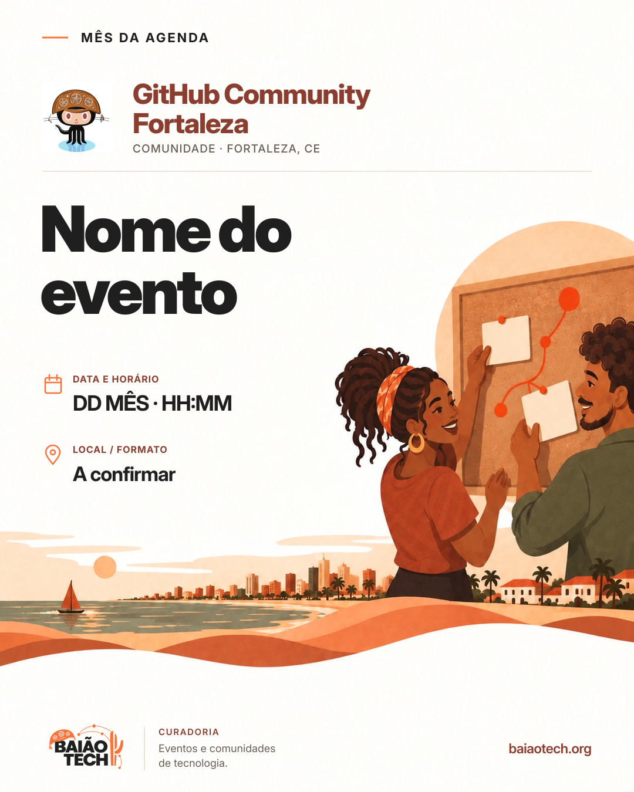

[SVG editável](comunidades/github-community-fortaleza/modelo.svg) · [PNG](comunidades/github-community-fortaleza/modelo.png) · [Estilo](comunidades/github-community-fortaleza/estilo.json)

## GraphQL Recife

Consultas conectadas e intercâmbio de experiências com dados em produção.

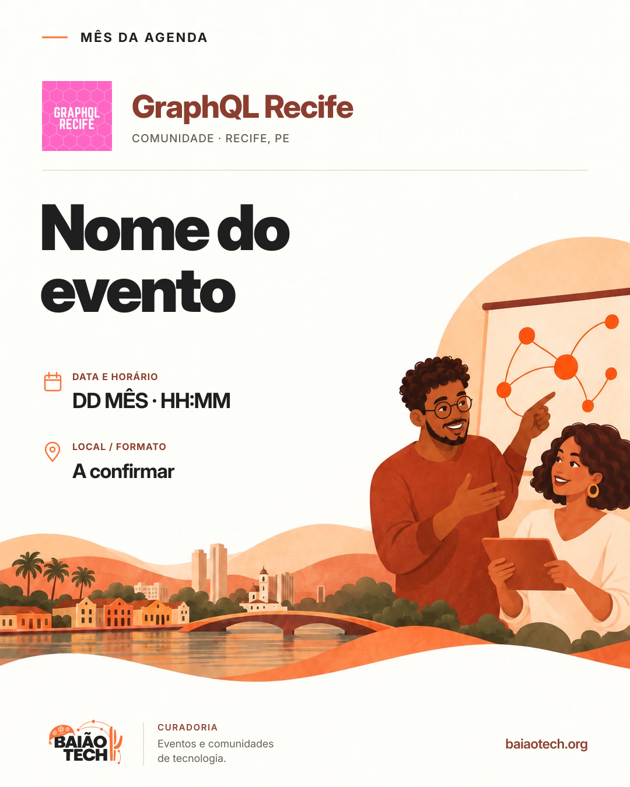

[SVG editável](comunidades/graphql-recife/modelo.svg) · [PNG](comunidades/graphql-recife/modelo.png) · [Estilo](comunidades/graphql-recife/estilo.json)

## JampaRuby

Programação Ruby e código reutilizável em João Pessoa, em uma oficina de componentes de software.

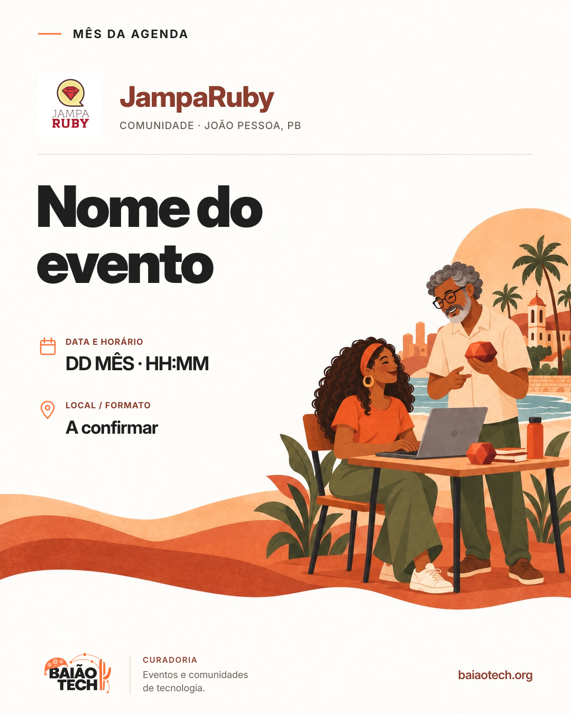

[SVG editável](comunidades/jamparuby/modelo.svg) · [PNG](comunidades/jamparuby/modelo.png) · [Estilo](comunidades/jamparuby/estilo.json)

## JavaBahia

Troca de conhecimento Java e contribuição open-source entre desenvolvedores da Bahia.

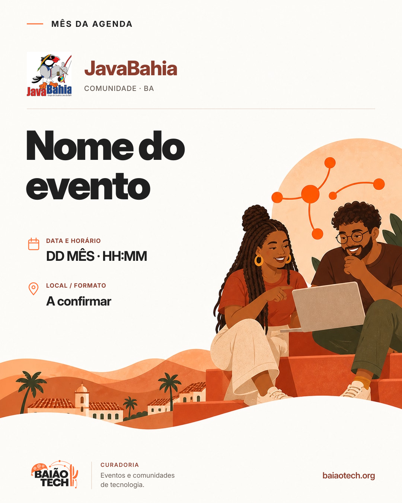

[SVG editável](comunidades/javabahia/modelo.svg) · [PNG](comunidades/javabahia/modelo.png) · [Estilo](comunidades/javabahia/estilo.json)

## Javax CE

Estudo do ecossistema JVM no Ceará, reunindo diferentes tecnologias em uma plataforma compartilhada.

[SVG editável](comunidades/javax-ce/modelo.svg) · [PNG](comunidades/javax-ce/modelo.png) · [Estilo](comunidades/javax-ce/estilo.json)

## Jerimum Valley

Mentoria e conexões do ecossistema de startups de Natal, com o jerimum como elemento cultural.

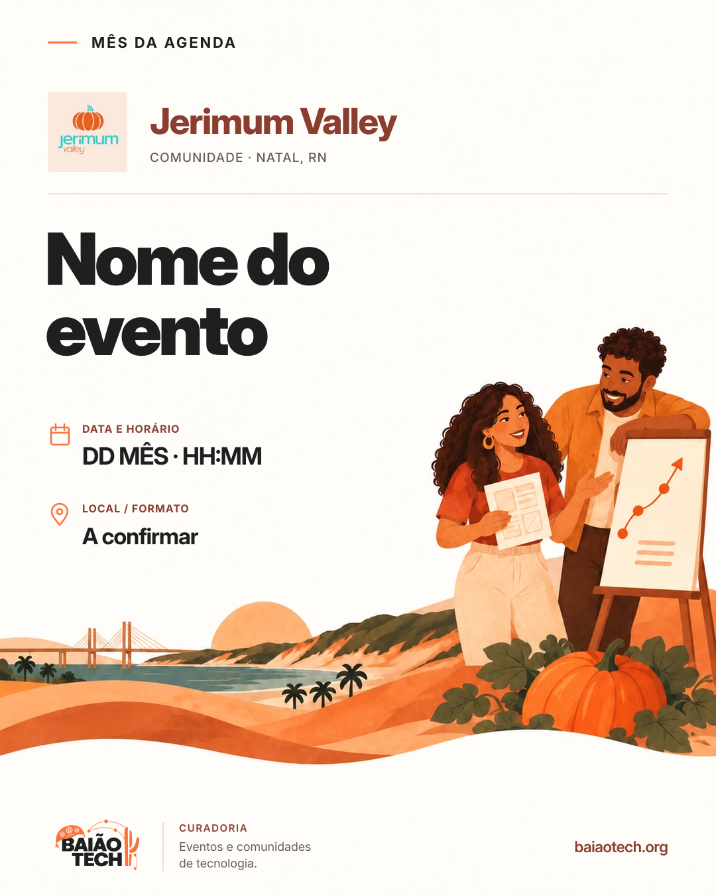

[SVG editável](comunidades/jerimum-valley/modelo.svg) · [PNG](comunidades/jerimum-valley/modelo.png) · [Estilo](comunidades/jerimum-valley/estilo.json)

## Ladies That UX Recife

Pesquisa de experiência do usuário e troca de práticas entre mulheres em Recife.

[SVG editável](comunidades/ladies-that-ux-recife/modelo.svg) · [PNG](comunidades/ladies-that-ux-recife/modelo.png) · [Estilo](comunidades/ladies-that-ux-recife/estilo.json)

## Manguezal

Colaboração empreendedora em Recife, inspirada nas conexões do mangue e da tecnologia.

[SVG editável](comunidades/manguezal/modelo.svg) · [PNG](comunidades/manguezal/modelo.png) · [Estilo](comunidades/manguezal/estilo.json)

## MEETIA-PB

Aprendizado colaborativo em inteligência artificial e ciência de dados na Paraíba.

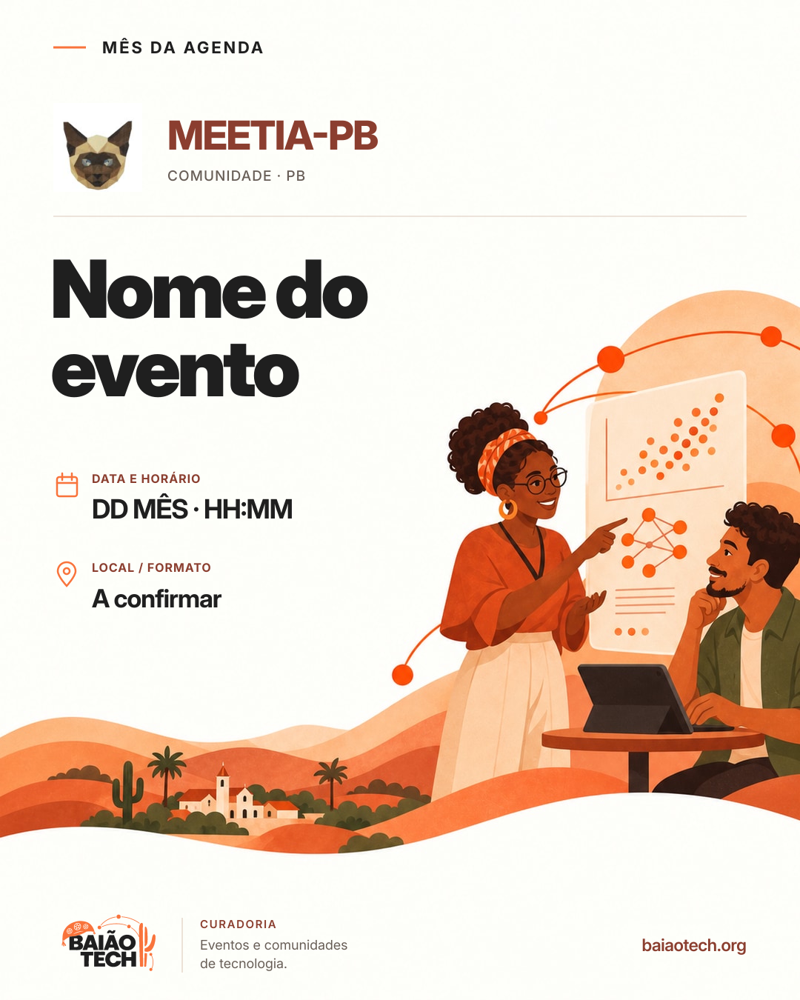

[SVG editável](comunidades/meetia-pb/modelo.svg) · [PNG](comunidades/meetia-pb/modelo.png) · [Estilo](comunidades/meetia-pb/estilo.json)

## .NET Ceará

Estudo de desenvolvimento .NET e arquitetura de aplicações no Ceará.

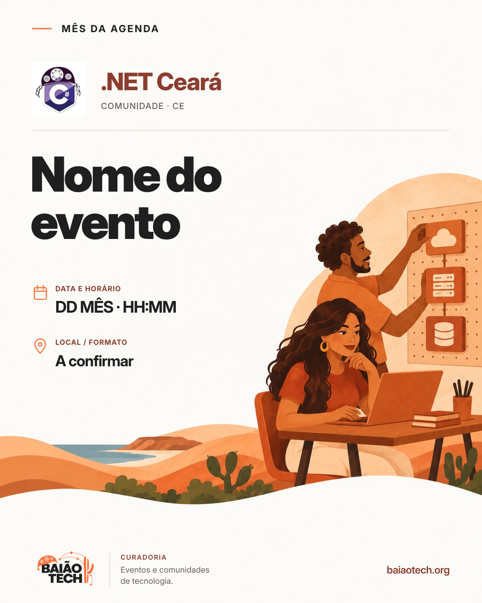

[SVG editável](comunidades/net-ceara/modelo.svg) · [PNG](comunidades/net-ceara/modelo.png) · [Estilo](comunidades/net-ceara/estilo.json)

## .NET PB

Encontros virtuais e colaboração entre desenvolvedores .NET na Paraíba.

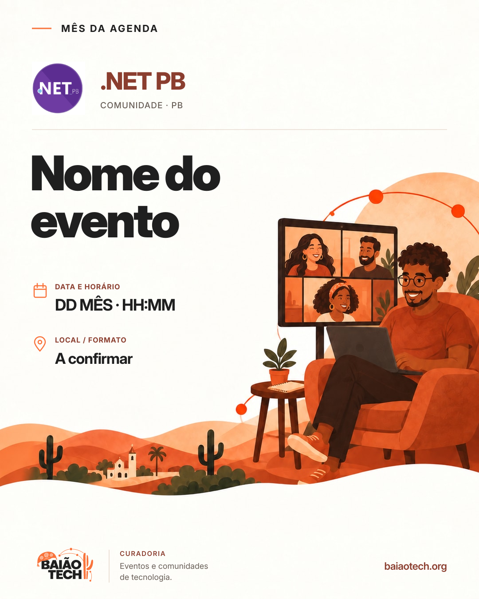

[SVG editável](comunidades/net-pb/modelo.svg) · [PNG](comunidades/net-pb/modelo.png) · [Estilo](comunidades/net-pb/estilo.json)

## OWASP Fortaleza

Aprendizado em segurança de aplicações e revisão de boas práticas em Fortaleza.

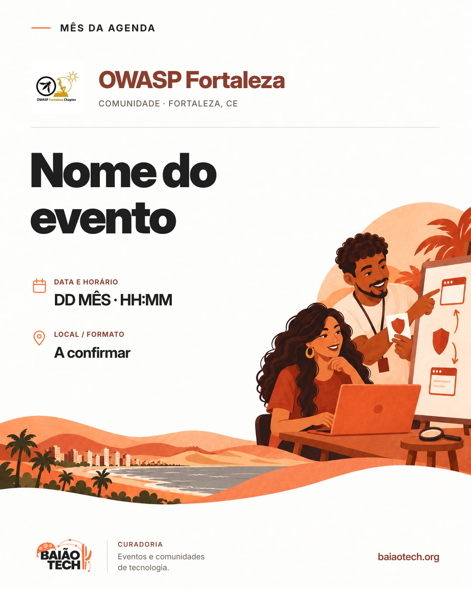

[SVG editável](comunidades/owasp-fortaleza/modelo.svg) · [PNG](comunidades/owasp-fortaleza/modelo.png) · [Estilo](comunidades/owasp-fortaleza/estilo.json)

## Grude4J

Aprendizado Java/JVM em palestra prática na Paraíba.

[SVG editável](comunidades/grude4j/modelo.svg) · [PNG](comunidades/grude4j/modelo.png) · [Estilo](comunidades/grude4j/estilo.json)

## GrudePB / CRUDPB

Integração de comunidades paraibanas em um ecossistema colaborativo.

[SVG editável](comunidades/grudepb-crudpb/modelo.svg) · [PNG](comunidades/grudepb-crudpb/modelo.png) · [Estilo](comunidades/grudepb-crudpb/estilo.json)

## GruPy-BA

Troca de dúvidas e colaboração Python entre pessoas da Bahia.

[SVG editável](comunidades/grupy-ba/modelo.svg) · [PNG](comunidades/grupy-ba/modelo.png) · [Estilo](comunidades/grupy-ba/estilo.json)

## GruPy-RN

Ambiente inclusivo de aprendizagem e projetos Python potiguares.

[SVG editável](comunidades/grupy-rn/modelo.svg) · [PNG](comunidades/grupy-rn/modelo.png) · [Estilo](comunidades/grupy-rn/estilo.json)

## GTS-CE

Investigação da qualidade de software e testes exploratórios no Ceará.

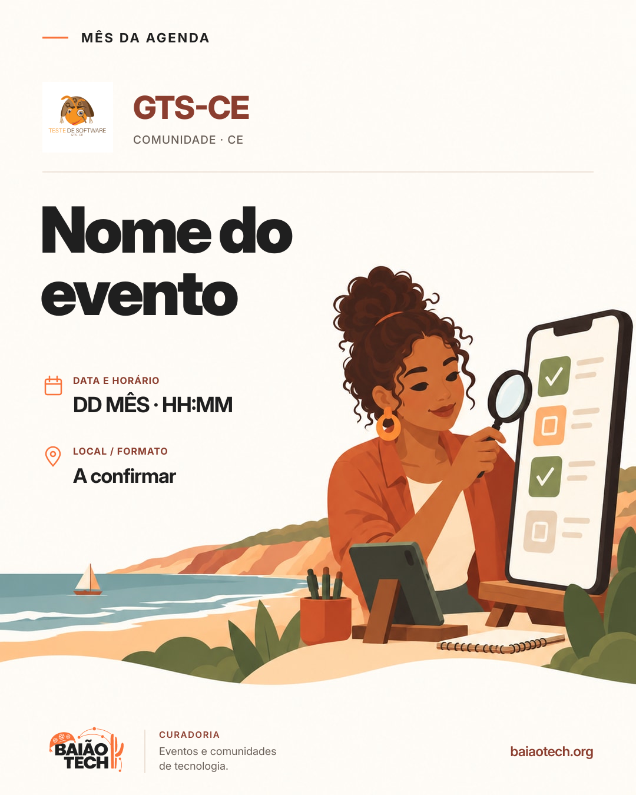

[SVG editável](comunidades/gts-ce/modelo.svg) · [PNG](comunidades/gts-ce/modelo.png) · [Estilo](comunidades/gts-ce/estilo.json)

## GURU-CE

Construção colaborativa de aplicações Ruby no Ceará.

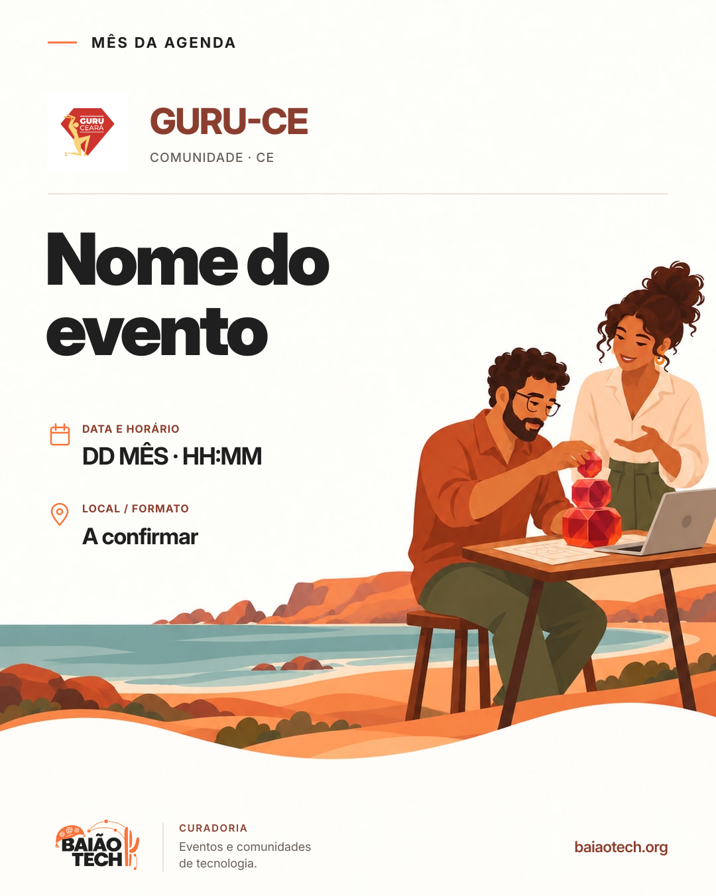

[SVG editável](comunidades/guru-ce/modelo.svg) · [PNG](comunidades/guru-ce/modelo.png) · [Estilo](comunidades/guru-ce/estilo.json)

## GUTS-PB

Boas práticas de testes e confiabilidade compartilhadas na Paraíba.

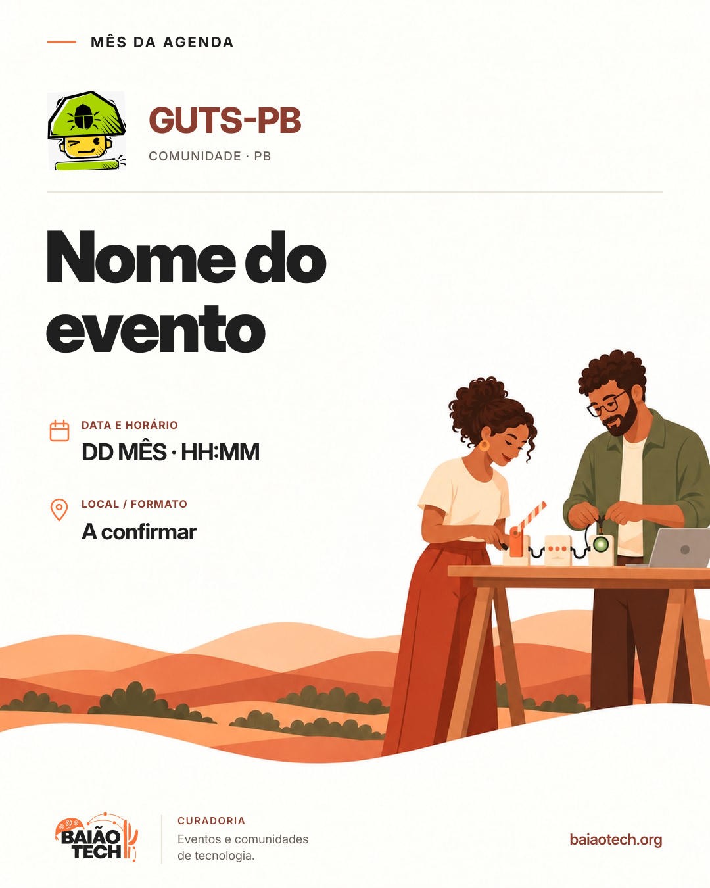

[SVG editável](comunidades/guts-pb/modelo.svg) · [PNG](comunidades/guts-pb/modelo.png) · [Estilo](comunidades/guts-pb/estilo.json)

## Hack In Cariri

Aprendizado de segurança, CTF e desafios colaborativos no Cariri.

[SVG editável](comunidades/hack-in-cariri/modelo.svg) · [PNG](comunidades/hack-in-cariri/modelo.png) · [Estilo](comunidades/hack-in-cariri/estilo.json)

## HouseJS

Encontros descontraídos para compartilhar o ecossistema JavaScript cearense.

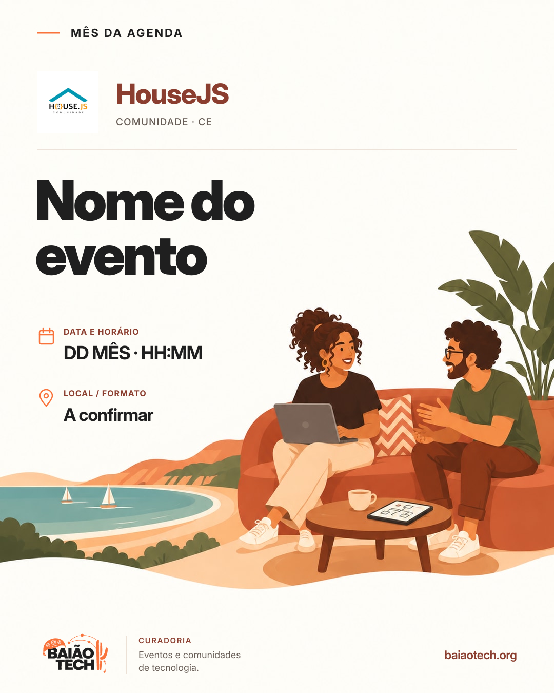

[SVG editável](comunidades/housejs/modelo.svg) · [PNG](comunidades/housejs/modelo.png) · [Estilo](comunidades/housejs/estilo.json)

## IFPE Open Source

Aprender fazendo com estudantes, cultura maker e código aberto em Pernambuco.

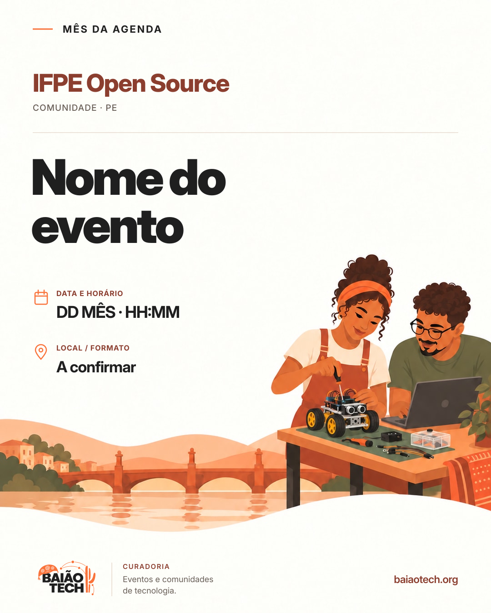

[SVG editável](comunidades/ifpe-open-source/modelo.svg) · [PNG](comunidades/ifpe-open-source/modelo.png) · [Estilo](comunidades/ifpe-open-source/estilo.json)

## OWASP Natal

Aprendizado de desenvolvimento seguro e revisão de aplicações no contexto potiguar.

[SVG editável](comunidades/owasp-natal/modelo.svg) · [PNG](comunidades/owasp-natal/modelo.png) · [Estilo](comunidades/owasp-natal/estilo.json)

## OWASP-PB

Conscientização em segurança de aplicações e boas práticas compartilhadas na Paraíba.

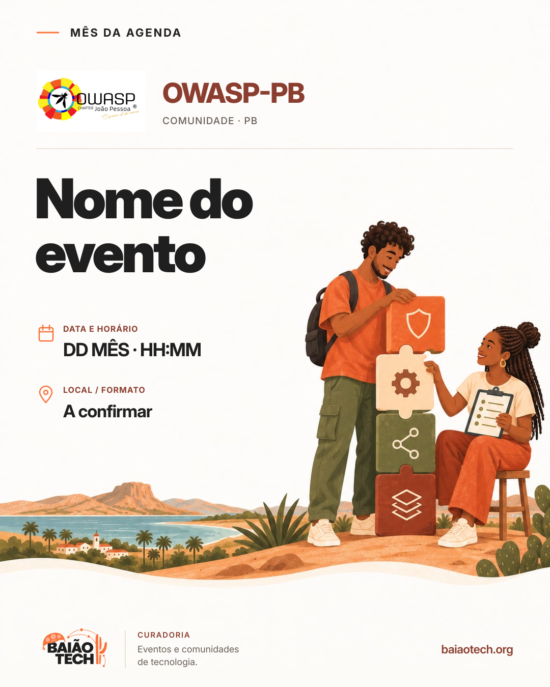

[SVG editável](comunidades/owasp-pb/modelo.svg) · [PNG](comunidades/owasp-pb/modelo.png) · [Estilo](comunidades/owasp-pb/estilo.json)

## OxenTI-PE

Integração das comunidades de TI da Grande Recife em um espaço de colaboração.

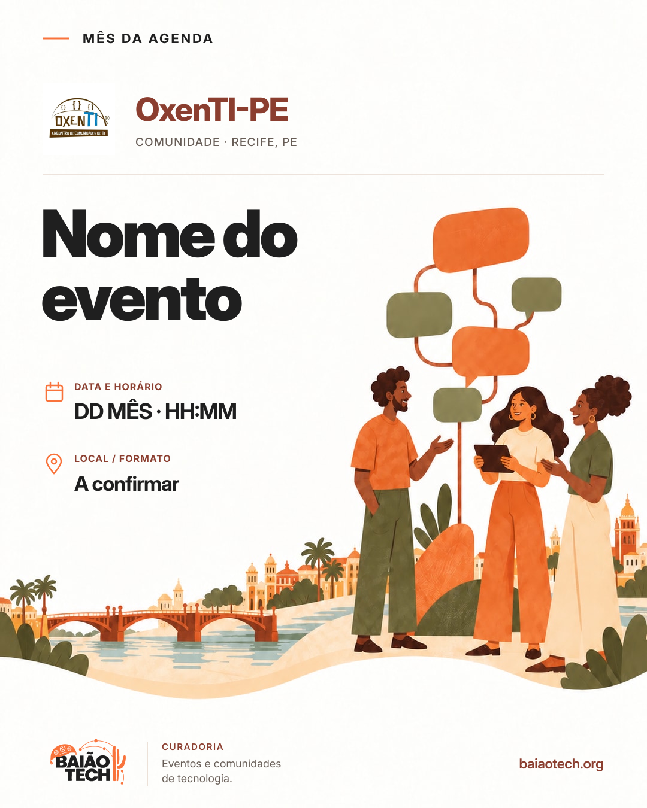

[SVG editável](comunidades/oxenti-pe/modelo.svg) · [PNG](comunidades/oxenti-pe/modelo.png) · [Estilo](comunidades/oxenti-pe/estilo.json)

## Paraíba.js

Troca de conhecimentos e apresentação de casos de JavaScript na Paraíba.

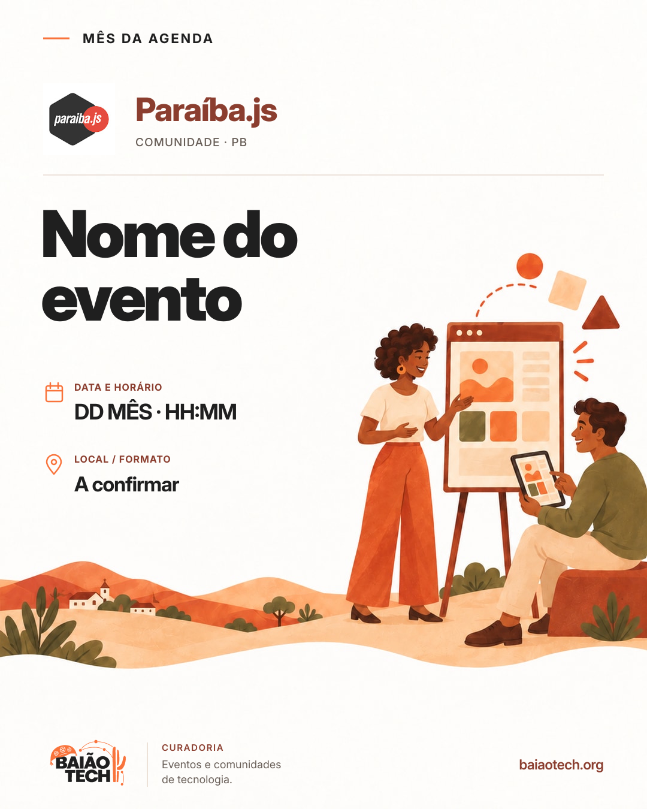

[SVG editável](comunidades/paraiba-js/modelo.svg) · [PNG](comunidades/paraiba-js/modelo.png) · [Estilo](comunidades/paraiba-js/estilo.json)

## PHP com Rapadura

Encontro de programadores PHP unido por troca técnica, café e rapadura no Ceará.

[SVG editável](comunidades/php-com-rapadura/modelo.svg) · [PNG](comunidades/php-com-rapadura/modelo.png) · [Estilo](comunidades/php-com-rapadura/estilo.json)

## PHP-Maranhão

Compartilhamento de linguagens e frameworks para desenvolvimento web no Maranhão.

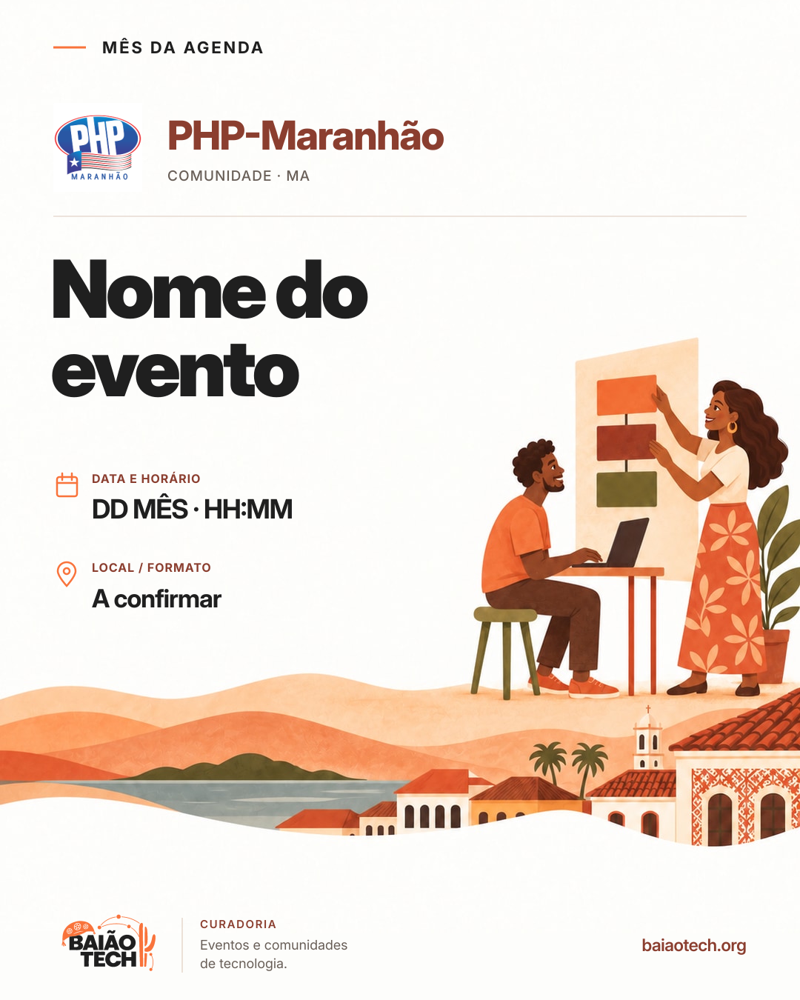

[SVG editável](comunidades/php-maranhao/modelo.svg) · [PNG](comunidades/php-maranhao/modelo.png) · [Estilo](comunidades/php-maranhao/estilo.json)

## PHP-PB

Mentoria entre diferentes níveis de experiência no ecossistema PHP paraibano.

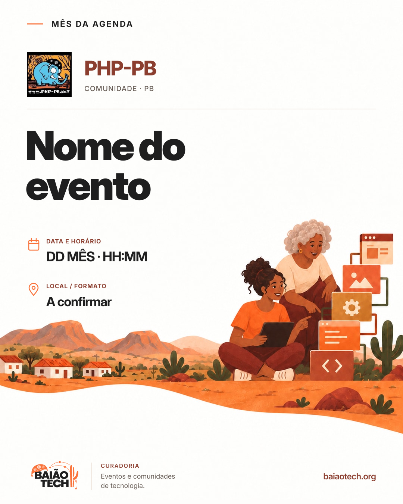

[SVG editável](comunidades/php-pb/modelo.svg) · [PNG](comunidades/php-pb/modelo.png) · [Estilo](comunidades/php-pb/estilo.json)

## PONG RN

Criação e testes colaborativos de jogos independentes potiguares.

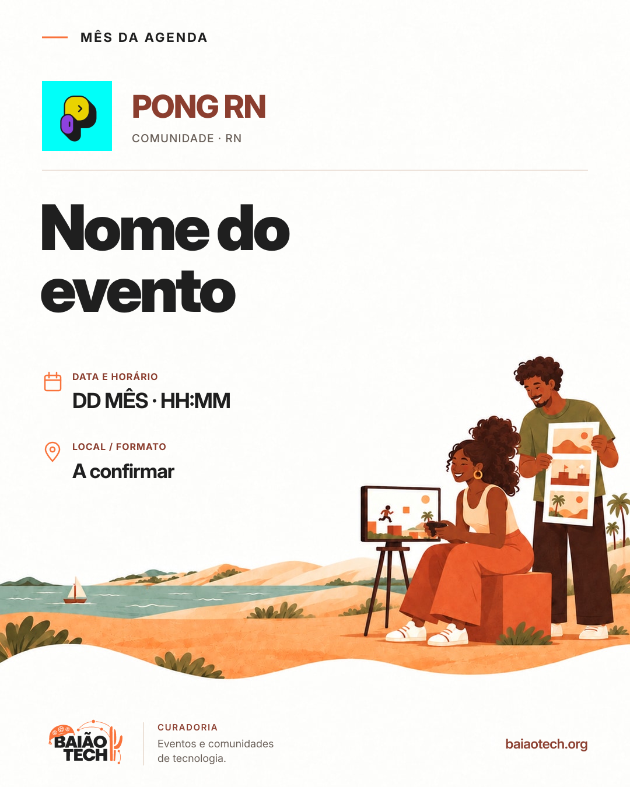

[SVG editável](comunidades/pong-rn/modelo.svg) · [PNG](comunidades/pong-rn/modelo.png) · [Estilo](comunidades/pong-rn/estilo.json)

## Potiguaras Valley

Empreendedorismo e inovação conectando talentos do Seridó e do Trairi.

[SVG editável](comunidades/potiguaras-valley/modelo.svg) · [PNG](comunidades/potiguaras-valley/modelo.png) · [Estilo](comunidades/potiguaras-valley/estilo.json)

## Projeto Software Livre Bahia

Colaboração aberta e circulação de conhecimento no movimento de software livre baiano.

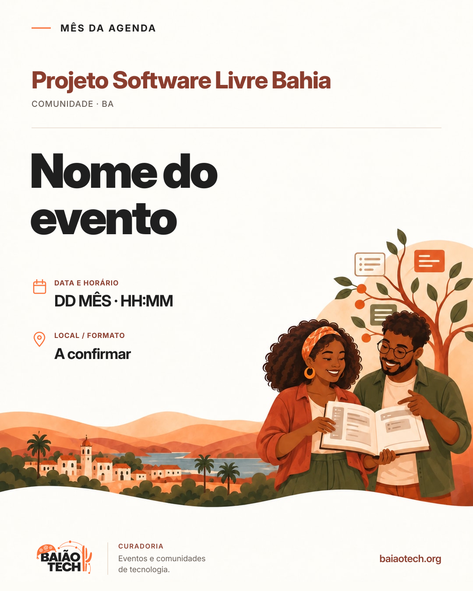

[SVG editável](comunidades/projeto-software-livre-bahia/modelo.svg) · [PNG](comunidades/projeto-software-livre-bahia/modelo.png) · [Estilo](comunidades/projeto-software-livre-bahia/estilo.json)

## PUG-AL (GruPy-AL)

Palestra e troca de conhecimento Python em Alagoas: voluntária demonstra componentes de um projeto aberto e participante registra ideias, sobre paisagem lagunar contínua.

[SVG editável](comunidades/pug-al-grupy-al/modelo.svg) · [PNG](comunidades/pug-al-grupy-al/modelo.png) · [Estilo](comunidades/pug-al-grupy-al/estilo.json)

## PUG-CE

Aprendizado contínuo Python: sessão de perguntas e respostas entre programador e facilitadora, com cartões de dúvidas em painel e paisagem do Ceará.

[SVG editável](comunidades/pug-ce/modelo.svg) · [PNG](comunidades/pug-ce/modelo.png) · [Estilo](comunidades/pug-ce/estilo.json)

## PUG-MA

Rede de troca de dicas Python no Maranhão: desenvolvedora conecta uma chamada de grupo ao colega em um canto de estudo.

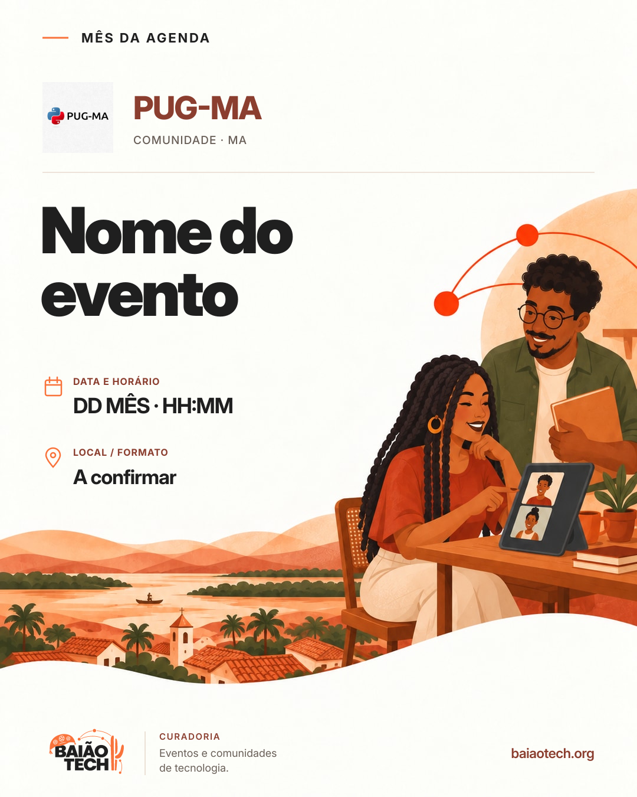

[SVG editável](comunidades/pug-ma/modelo.svg) · [PNG](comunidades/pug-ma/modelo.png) · [Estilo](comunidades/pug-ma/estilo.json)

## PUG-PB (Python Paraíba)

Colaboração Python na Paraíba: revisão de contribuições de um projeto aberto com cartões de etapas em mesa compartilhada.

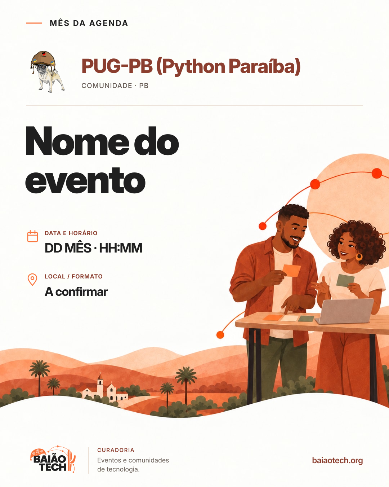

[SVG editável](comunidades/pug-pb-python-paraiba/modelo.svg) · [PNG](comunidades/pug-pb-python-paraiba/modelo.png) · [Estilo](comunidades/pug-pb-python-paraiba/estilo.json)

## PUG-PE

Aprendizado inclusivo Python em Pernambuco: pequena roda de compartilhamento de soluções com laptop e caderno de exercícios.

[SVG editável](comunidades/pug-pe/modelo.svg) · [PNG](comunidades/pug-pe/modelo.png) · [Estilo](comunidades/pug-pe/estilo.json)

## PUG-PI

Suporte e crescimento do ecossistema Python piauiense: desenvolvedor experiente ajuda iniciante a depurar um exercício.

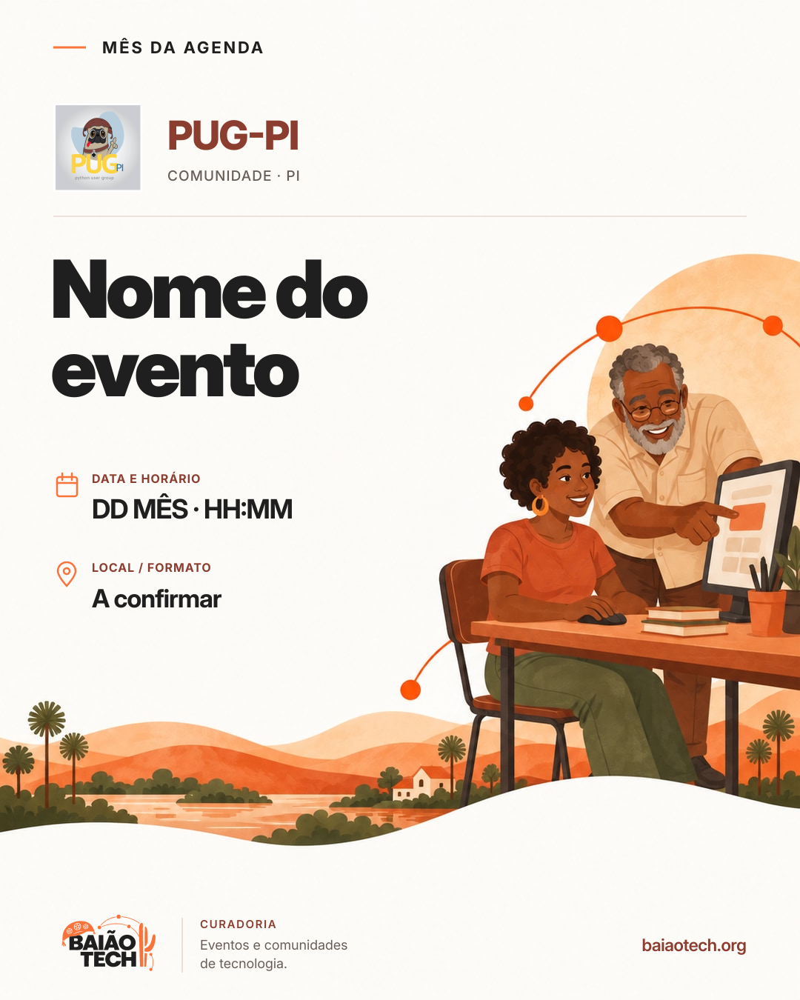

[SVG editável](comunidades/pug-pi/modelo.svg) · [PNG](comunidades/pug-pi/modelo.png) · [Estilo](comunidades/pug-pi/estilo.json)

## PUG-SE

Contribuição open-source Python em Sergipe: dupla organiza documentação e melhorias de um projeto aberto.

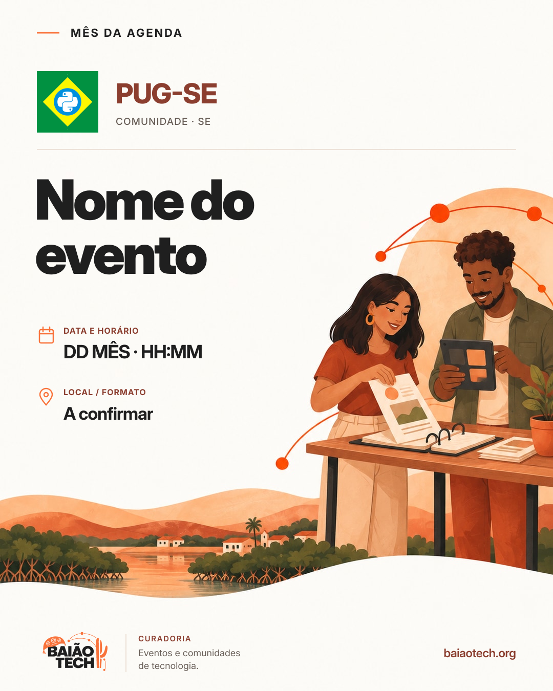

[SVG editável](comunidades/pug-se/modelo.svg) · [PNG](comunidades/pug-se/modelo.png) · [Estilo](comunidades/pug-se/estilo.json)

## PyLadies Natal

Estudo e mentoria entre mulheres Python em Natal: desenvolvedora orienta exercício de programação em ambiente acolhedor.

[SVG editável](comunidades/pyladies-natal/modelo.svg) · [PNG](comunidades/pyladies-natal/modelo.png) · [Estilo](comunidades/pyladies-natal/estilo.json)

## PyLadies Recife

Coding dojo e rede de apoio de mulheres Python no Recife: dupla alterna a implementação e a discussão de uma solução.

[SVG editável](comunidades/pyladies-recife/modelo.svg) · [PNG](comunidades/pyladies-recife/modelo.png) · [Estilo](comunidades/pyladies-recife/estilo.json)

## PyLadies Sergipe

Capacitação e apoio mútuo entre mulheres Python em Sergipe: facilitadoras compartilham exercícios e recursos de aprendizagem.

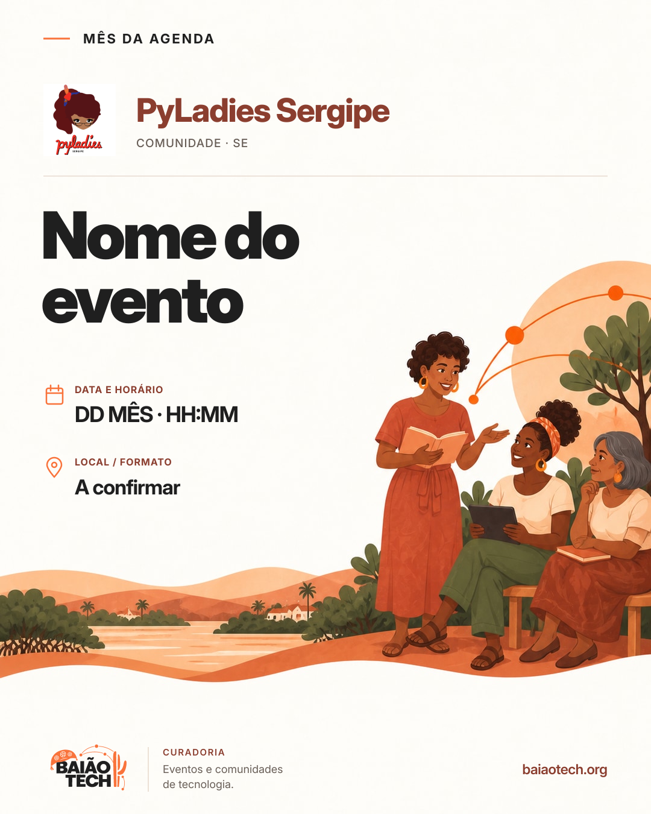

[SVG editável](comunidades/pyladies-sergipe/modelo.svg) · [PNG](comunidades/pyladies-sergipe/modelo.png) · [Estilo](comunidades/pyladies-sergipe/estilo.json)

## Women Techmakers João Pessoa

Protagonismo feminino e troca entre gerações sobre carreiras em tecnologia em João Pessoa, em uma conversa com microfone e trilha de desenvolvimento profissional.

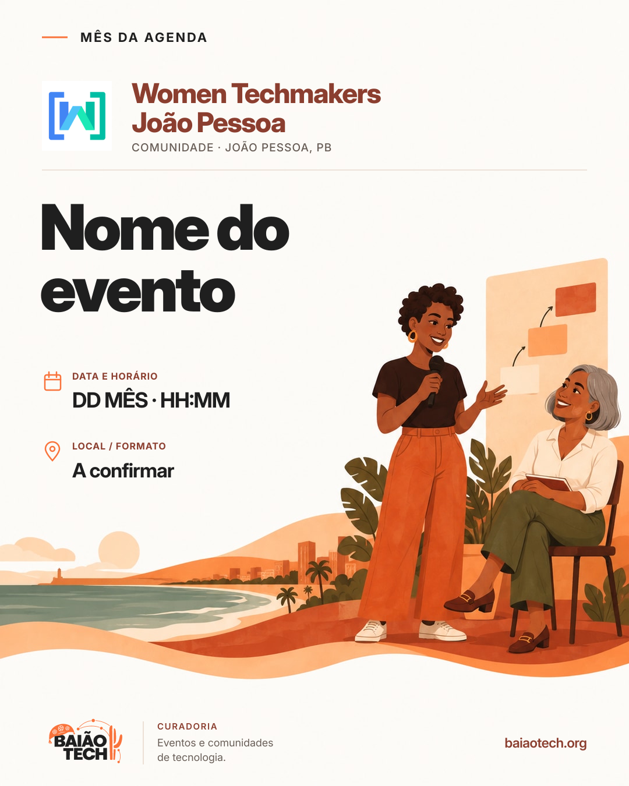

[SVG editável](comunidades/women-techmakers-joao-pessoa/modelo.svg) · [PNG](comunidades/women-techmakers-joao-pessoa/modelo.png) · [Estilo](comunidades/women-techmakers-joao-pessoa/estilo.json)

## Women Who Code Recife

Mentoria e revisão colaborativa de programação entre mulheres em Recife, com monitor de código abstrato e anotações de estudo.

[SVG editável](comunidades/women-who-code-recife/modelo.svg) · [PNG](comunidades/women-who-code-recife/modelo.png) · [Estilo](comunidades/women-who-code-recife/estilo.json)

## WordPress Fortaleza

Oficina de criação de sites e componentes WordPress em Fortaleza, com montagem colaborativa de um layout modular.

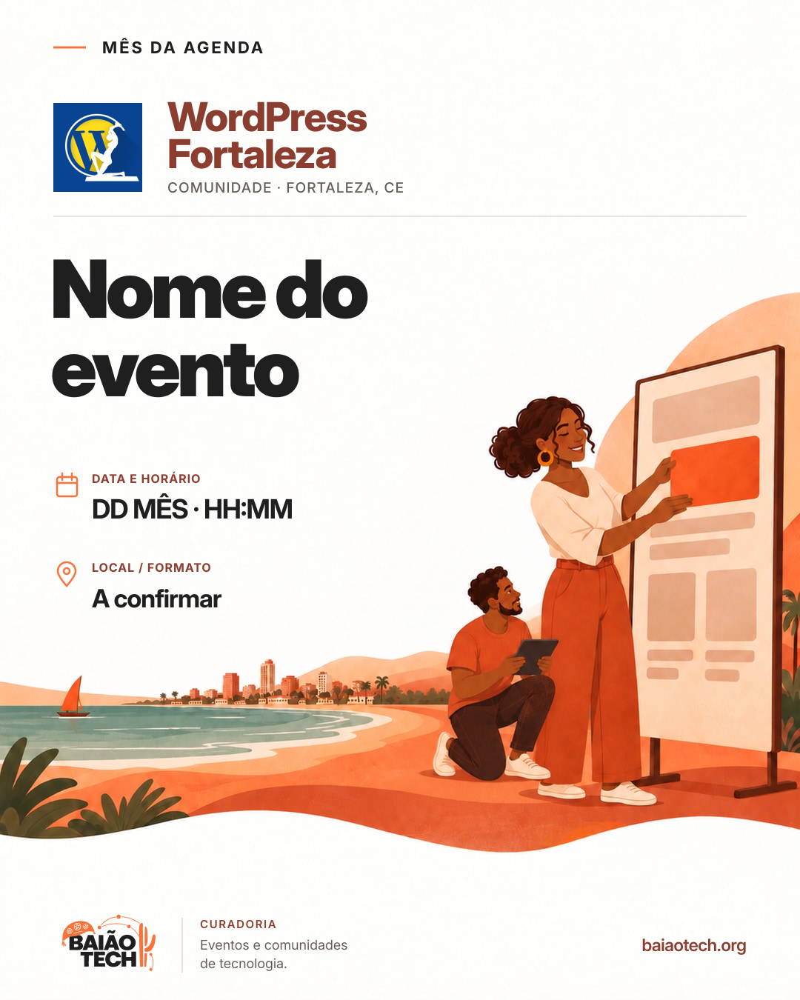

[SVG editável](comunidades/wordpress-fortaleza/modelo.svg) · [PNG](comunidades/wordpress-fortaleza/modelo.png) · [Estilo](comunidades/wordpress-fortaleza/estilo.json)

## Rails Girls Fortaleza

Oficina acolhedora de primeiros passos em desenvolvimento web Ruby on Rails para mulheres, com mentoria e aprendizagem prática.

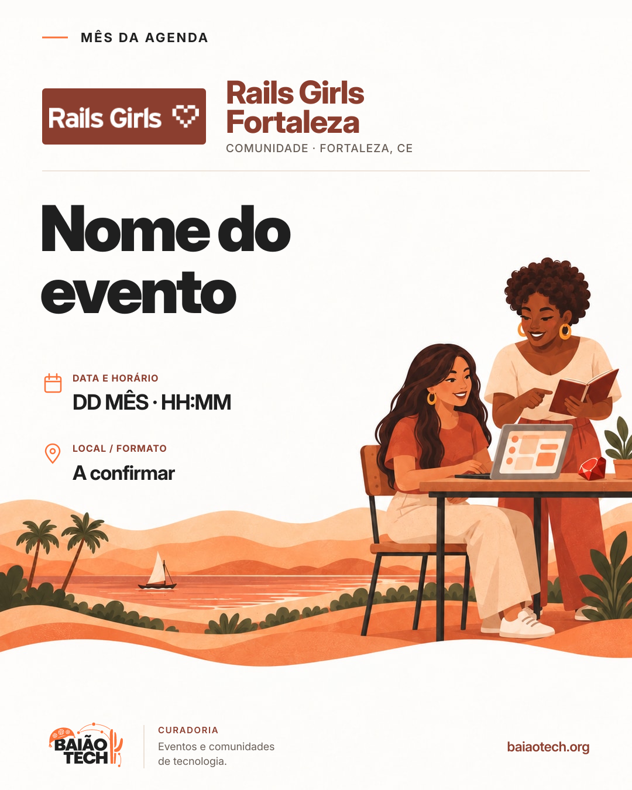

[SVG editável](comunidades/rails-girls-fortaleza/modelo.svg) · [PNG](comunidades/rails-girls-fortaleza/modelo.png) · [Estilo](comunidades/rails-girls-fortaleza/estilo.json)

## Rapadura Valley

Conexão entre empreendedores e inovação cearense, com protótipo e identidade cultural da rapadura.

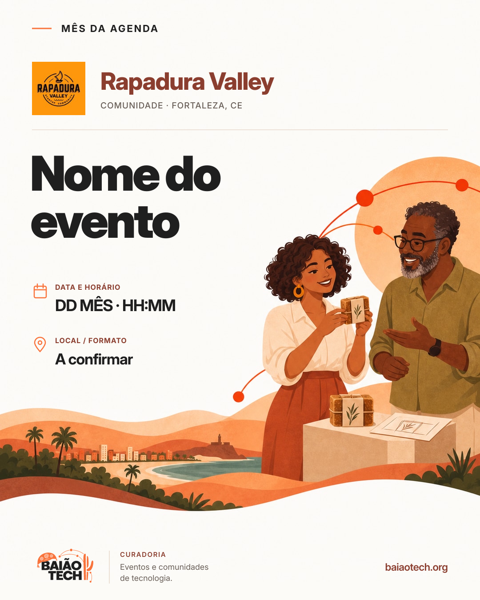

[SVG editável](comunidades/rapadura-valley/modelo.svg) · [PNG](comunidades/rapadura-valley/modelo.png) · [Estilo](comunidades/rapadura-valley/estilo.json)

## React Ladies

Mulheres liderando estudos colaborativos de componentes React e desenvolvimento front-end.

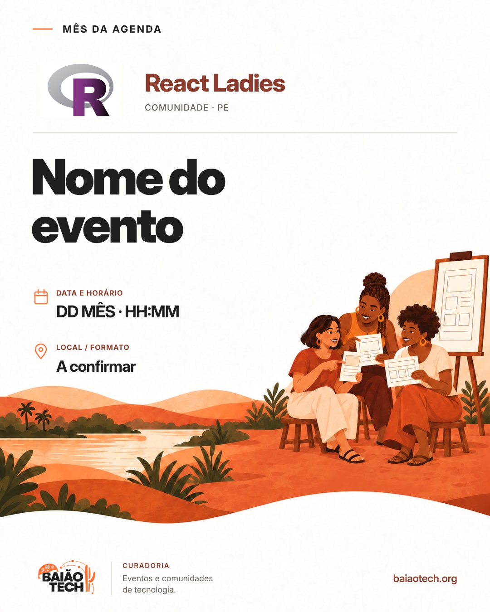

[SVG editável](comunidades/react-ladies/modelo.svg) · [PNG](comunidades/react-ladies/modelo.png) · [Estilo](comunidades/react-ladies/estilo.json)

## React Recife

Aprendizado conjunto em React para interfaces web e móveis, articulando as duas plataformas.

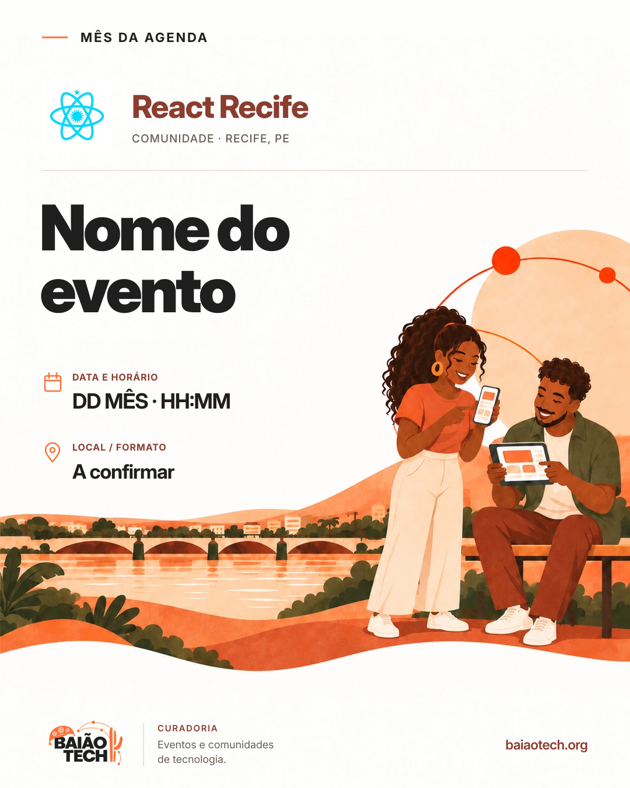

[SVG editável](comunidades/react-recife/modelo.svg) · [PNG](comunidades/react-recife/modelo.png) · [Estilo](comunidades/react-recife/estilo.json)

## ReactJS Ceará

Troca de experiências do ecossistema React em uma conversa técnica sobre aplicações modernas.

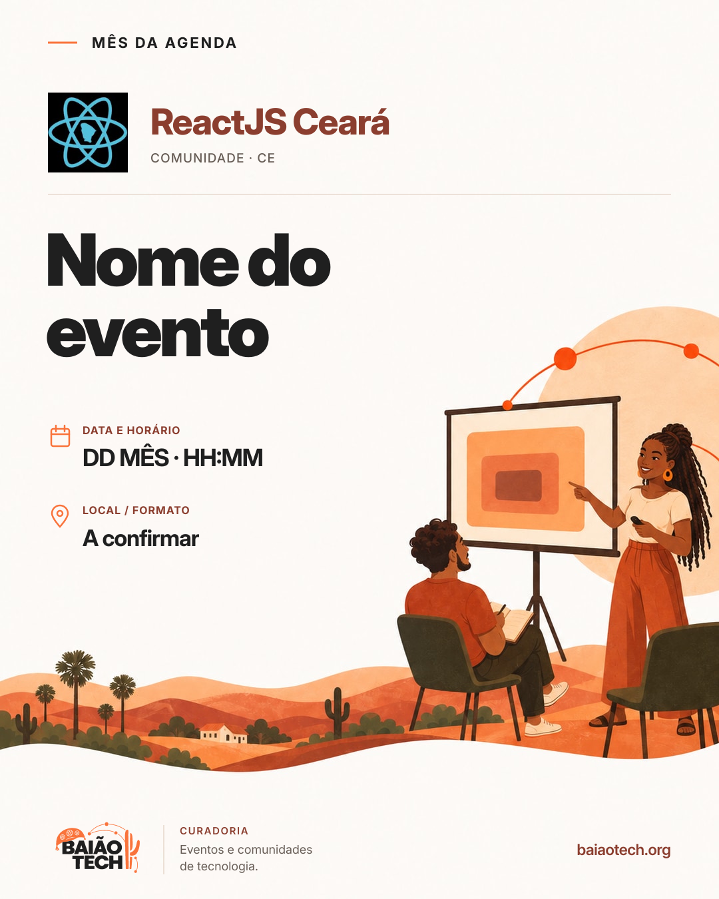

[SVG editável](comunidades/reactjs-ceara/modelo.svg) · [PNG](comunidades/reactjs-ceara/modelo.png) · [Estilo](comunidades/reactjs-ceara/estilo.json)

## Recife Front-End Community

Conexões multidisciplinares entre desenvolvimento, dados e design no ecossistema de Recife.

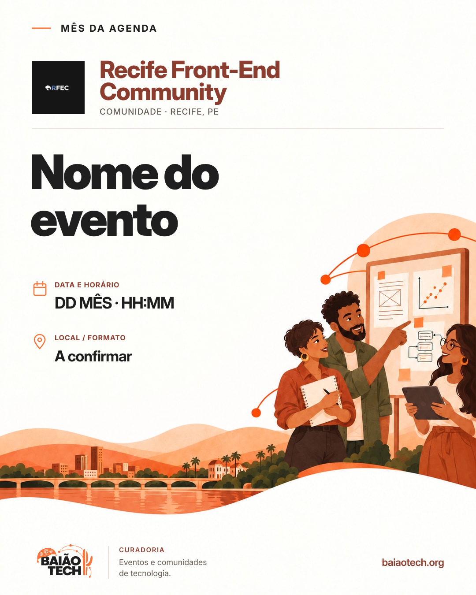

[SVG editável](comunidades/recife-front-end-community/modelo.svg) · [PNG](comunidades/recife-front-end-community/modelo.png) · [Estilo](comunidades/recife-front-end-community/estilo.json)

## Santana Valley

Empreendedorismo e inovação no interior baiano, com colaboração em novos produtos e serviços.

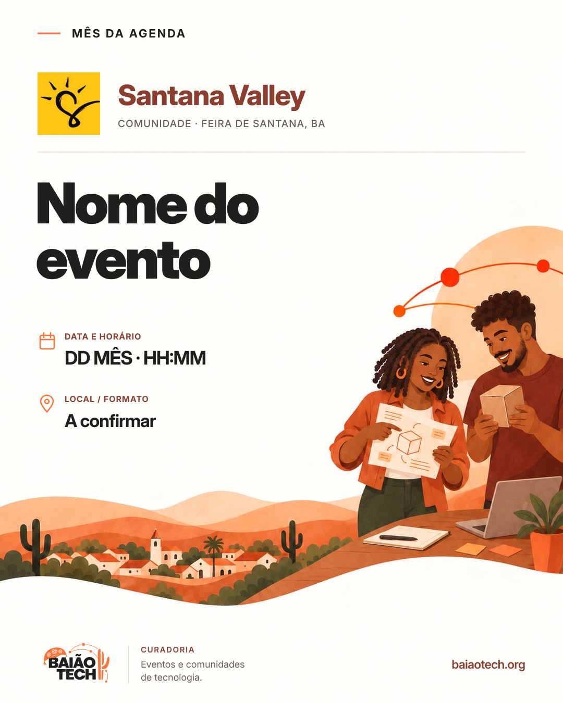

[SVG editável](comunidades/santana-valley/modelo.svg) · [PNG](comunidades/santana-valley/modelo.png) · [Estilo](comunidades/santana-valley/estilo.json)

## SOLuíses

Economia criativa, dados e empreendedorismo conectados por projetos colaborativos no Maranhão.

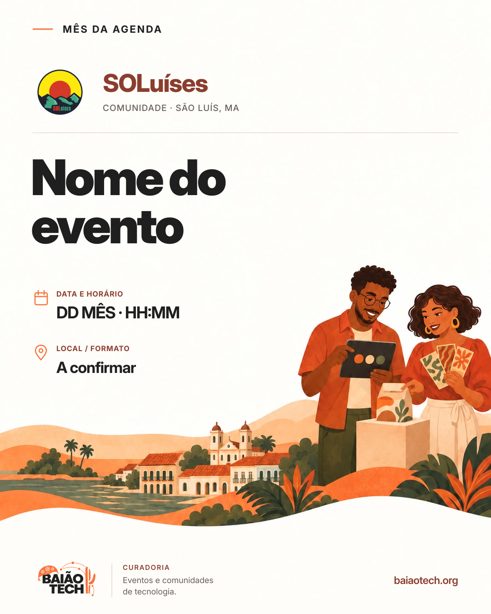

[SVG editável](comunidades/soluises/modelo.svg) · [PNG](comunidades/soluises/modelo.png) · [Estilo](comunidades/soluises/estilo.json)

## Sururu Valley

Conexão entre ciência, tecnologia e empreendedorismo em Alagoas.

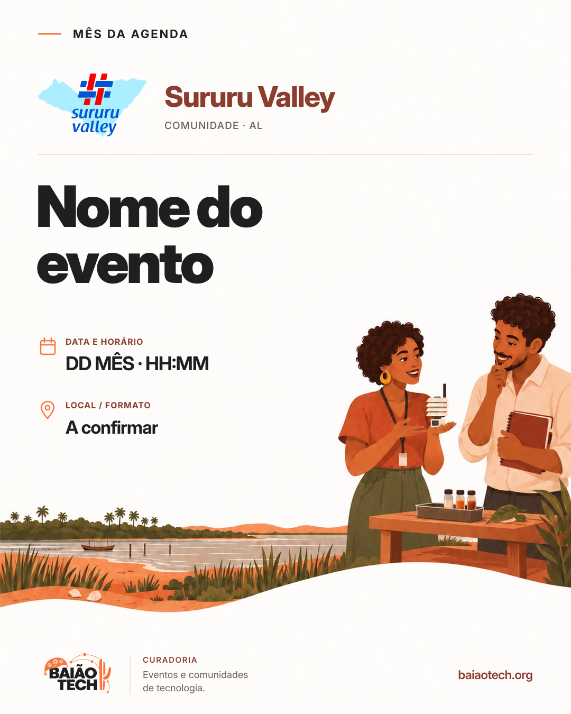

[SVG editável](comunidades/sururu-valley/modelo.svg) · [PNG](comunidades/sururu-valley/modelo.png) · [Estilo](comunidades/sururu-valley/estilo.json)

## WiDS Recife

Visibilidade de mulheres em ciência de dados e aprendizado de máquina, por meio de apresentações e troca de conhecimento.

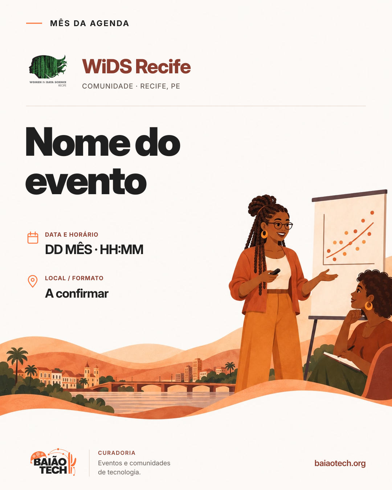

[SVG editável](comunidades/wids-recife/modelo.svg) · [PNG](comunidades/wids-recife/modelo.png) · [Estilo](comunidades/wids-recife/estilo.json)

## Genérico com logo

Comunidade aberta de tecnologia e conexão entre pessoas, sem atribuição a uma organização cadastrada.

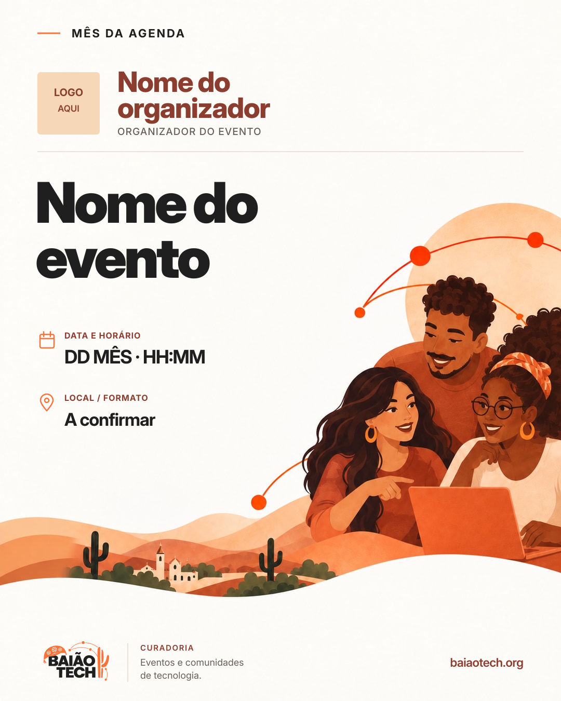

[SVG editável](genericos/com-logo/modelo.svg) · [PNG](genericos/com-logo/modelo.png) · [Estilo](genericos/com-logo/estilo.json)

## Genérico sem logo

Comunidade aberta de tecnologia e conexão entre pessoas, sem atribuição a uma organização cadastrada.

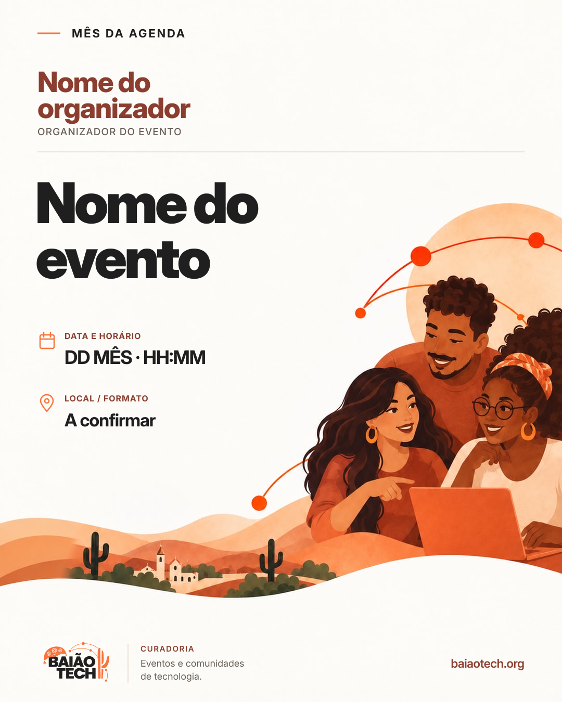

[SVG editável](genericos/sem-logo/modelo.svg) · [PNG](genericos/sem-logo/modelo.png) · [Estilo](genericos/sem-logo/estilo.json)
